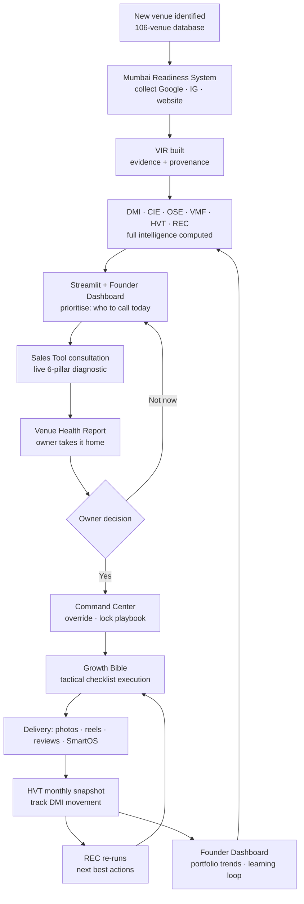

# DigiVenue — System Architecture Map

A complete map of every component built to date, how they connect, and what's still missing. Three layers:

```
   ┌──────────────────────── LAYER 3 · INTERFACES (what humans touch) ────────────────────────┐
   │  Sales Tool   ·   Command Center   ·   Growth Bible   ·   Founder Dashboard   ·  Streamlit │
   └───────────────────────────────────────────┬──────────────────────────────────────────────┘
   ┌───────────────────────── LAYER 2 · INTELLIGENCE (the brain) ─────────────────────────────┐
   │        VIR  →  DMI  →  CIE  →  OSE  →  VMF  →  HVT  →  REC   (7 chained engines)           │
   └───────────────────────────────────────────┬──────────────────────────────────────────────┘
   ┌───────────────────────── LAYER 1 · DATA (the machine) ───────────────────────────────────┐
   │   Mumbai Readiness System  —  collectors → scoring → exports → snapshots                   │
   └──────────────────────────────────────────────────────────────────────────────────────────┘
```

---

## LAYER 1 — Data engine

### Mumbai Readiness System  *(the pipeline)*
- **Purpose:** Discover, collect, score, prioritise, and track Mumbai banquet venues; the data backbone that feeds everything above it.
- **Inputs:** Google Maps (live API or mock seed of 106 real venues), Instagram & website signals, `relationship_intelligence.csv`, `outreach_outcomes.csv`, `settings.json`.
- **Outputs:** `exports/` → outreach queue (per-venue WhatsApp scripts), DMI tracker, territory clusters, 3km competitor maps, statistics, **`venue_intelligence_records.json`** (the new full records), `intelligence_data.js` (for the Sales Tool), monthly `historical/` snapshots.
- **Dependencies:** Python (pandas, requests), SQLite, the `intelligence/` module.
- **User:** Rohit / the sales team (run daily); indirectly every interface.
- **Current Status:** ✅ **Live.** Runs end-to-end on 106 venues; intelligence stack wired in.
- **Missing pieces:** Live Google API key not yet set (runs in estimate/mock mode); Instagram & website collectors are heuristic, not real scrapes; no real booking/inquiry data yet.

---

## LAYER 2 — Intelligence engines (the 7-engine brain)

### VIR — Venue Intelligence Record  *(the foundation)*
- **Purpose:** A single evidence-based record per venue — raw facts with provenance (source, timestamp, confidence), separated from scores.
- **Inputs:** A processed pipeline row (Google/Instagram/website/relationship signals).
- **Outputs:** A structured VIR JSON (8 sections) consumed by every engine below.
- **Dependencies:** `vir.schema.json`; built by `intelligence/pipeline_intelligence.py`.
- **User:** Machines (every downstream engine); inspectable by analysts.
- **Current Status:** ✅ **Live** — generated for all 106 venues each run.
- **Missing pieces:** Revenue/booking/inquiry fields are *estimated* (flagged low-confidence) until SmartOS supplies real data; some sections sparse (no real review velocity, claimed status).

### DMI — Digital Maturity Index  *(absolute score)*
- **Purpose:** Turn VIR facts into a 0–100 health score across Discoverability, Trust, Conversion, Operations, Intelligence.
- **Inputs:** A VIR.  **Outputs:** Overall DMI + 5 dimension scores + confidence + band.
- **Dependencies:** `dmi_v1.py` (config-driven weights/normalisers).
- **User:** Machines; surfaced to consultant & owner via interfaces.
- **Current Status:** ✅ **Live & integrated.** Spread 7–38 across the 106 (all weak prospects).
- **Missing pieces:** Weights are expert priors, not yet calibrated from outcomes.

### CIE — Competitive Intelligence Engine  *(relative rank)*
- **Purpose:** Rank a venue against its true peer cohort (suburb × type); "you're 18th percentile on reviews; leader has 2,100."
- **Inputs:** A VIR metric projection + all venues' metrics.  **Outputs:** Competitive Index, position (Leader→Laggard), per-metric you-vs-avg-vs-leader, percentiles.
- **Dependencies:** `cie_v1.py`.
- **User:** Consultant (in the pitch), owner (in the report).
- **Current Status:** ✅ **Live & integrated.** Healthy spread (11 Leaders … 10 Laggards).
- **Missing pieces:** Cohort fallback + t-digest sketches specced but not needed at 106-scale yet; activates at 100k+.

### OSE — Opportunity Score Engine  *(₹ at stake)*
- **Purpose:** Estimate monthly revenue lost to weak digital presence, as a conservative–aggressive range.
- **Inputs:** A VIR (funnel + revenue fields).  **Outputs:** Missed inquiries/visits/bookings/revenue range + confidence + advisory.
- **Dependencies:** `ose_v1.py`.
- **User:** Owner (the "what this is costing you" number), consultant.
- **Current Status:** ✅ **Live & integrated**, in honest low-confidence mode.
- **Missing pieces:** Needs real inquiry/booking volumes (currently estimated → flagged `conservative_only`).

### VMF — Venue Maturity Framework  *(the stage label)*
- **Purpose:** Classify a venue Traditional → Semi-Digital → Modern → Intelligent with a weakest-link gate.
- **Inputs:** A VIR (scored by DMI).  **Outputs:** Overall stage, per-dimension stage, weakest link, advancement roadmap, scorecard.
- **Dependencies:** `maturity_v1.py` (imports `dmi_v1`).
- **User:** Owner (one-word status + next move), consultant.
- **Current Status:** ✅ **Live & integrated** (all 106 currently Traditional — correct).
- **Missing pieces:** None functional; benefits from real Technology/Leadership data.

### HVT — Historical Venue Health Tracking  *(progress over time)*
- **Purpose:** Monthly snapshots → trends, growth rate, improvement/decline alerts.
- **Inputs:** Monthly DMI snapshots.  **Outputs:** Trajectory, growth %, alert feed.
- **Dependencies:** `tracker_v1.py`; snapshots in `historical/intelligence_snapshots/`.
- **User:** Founder (portfolio trends, churn watch), owner (their progress).
- **Current Status:** ✅ **Live & integrated** — baseline month captured; trends appear from month 2.
- **Missing pieces:** Only one month of history so far (by definition); needs time to accrue.

### REC — AI Recommendation Engine  *(next moves)*
- **Purpose:** Recommend the Top-3 actions + highest-impact action by *simulating* each fix through DMI & OSE.
- **Inputs:** A VIR.  **Outputs:** Ranked actions with expected ΔDMI, ₹/yr, confidence, effort.
- **Dependencies:** `reco_v1.py` (imports `dmi_v1`, `ose_v1`; reads `recommendations_confidence.json`).
- **User:** Consultant (what to pitch), delivery team (what to do).
- **Current Status:** ✅ **Live & integrated.**
- **Missing pieces:** Rule-based simulation now; uplift becomes a learned model once HVT + SmartOS outcomes accrue.

---

## LAYER 3 — Interfaces (what humans touch)

### Sales Tool  (`_Web/digistories-sales-tool-v2.html`)
- **Purpose:** The live 10-step, six-pillar Venue Growth Diagnostic run during a consultation; produces the printable Health Report.
- **Inputs:** Consultant's live entries; `intelligence_data.js` (pipeline panels); `benchmark_data.js`.
- **Outputs:** On-screen diagnosis, Recommendation (DigiStories/SmartOS/Both/Neither), printable owner report, exported intake JSON.
- **Dependencies:** Pipeline data files; the recommendation logic mirrors the engines.
- **User:** Consultant (with the owner).
- **Current Status:** ✅ **Built & working** (V3).
- **Missing pieces:** Still manual entry — not yet auto-prefilled from a venue's VIR; report is single-page, not the full 7-page premium spec.

### Command Center  (`_Web/command-center.html`)
- **Purpose:** Decision layer between diagnosis and execution — consultant overrides scores, packages, force-elevates rules, sets pipeline status, locks the playbook.
- **Inputs:** A VIR / intake JSON (manual import); pilot-venue seeds.
- **Outputs:** `approved_growth_config_*.json` (the locked playbook the Growth Bible reads).
- **Dependencies:** Reads VIR; writes config consumed by Growth Bible.
- **User:** Rohit / senior consultant.
- **Current Status:** ✅ **Built & working** (standalone).
- **Missing pieces:** Imports JSON manually — not yet auto-fed from `venue_intelligence_records.json`; CRM lifecycle is local only.

### Growth Bible  (`_Web/venue-growth-bible-engine.html`)
- **Purpose:** 27-chapter configurable strategy + 4 internal engines (Diagnosis/Strategy/Execution/Learning); turns a locked config into a tactical checklist with feedback.
- **Inputs:** A VIR or `approved_growth_config` (import); `recommendations_confidence.json`, `bcda_statistics.json`.
- **Outputs:** Per-venue strategy, prioritised checklist, 👍/👎 outcome logging.
- **Dependencies:** Command Center config; benchmark/confidence data.
- **User:** Delivery team.
- **Current Status:** ✅ **Built & working** (V3, six-pillar nav, ch01–ch27).
- **Missing pieces:** Hydration is manual import; LearningEngine feedback is local (not yet looped back into the pipeline's models).

### Founder Dashboard  (`_Web/founder-dashboard.html`)
- **Purpose:** Portfolio intelligence — close rates, suburb leaders, objection frequencies, top leaks, plus a pattern-recognition engine that induces rules.
- **Inputs:** Intake JSONs (drag-drop import) or seeded pilots.
- **Outputs:** Aggregate stats, induced patterns, visual cards.
- **Dependencies:** Sales Tool intake exports.
- **User:** Rohit (founder view).
- **Current Status:** ✅ **Built & working** (seeded + import).
- **Missing pieces:** Reads imported/seeded JSON — not yet a live feed from `venue_intelligence_records.json`.

### Streamlit Dashboard  (`dashboard/app.py`)
- **Purpose:** Internal daily view — DMI rankings, outreach queue, territory & competitor intelligence, the 5 sales panels, per-venue intelligence card.
- **Inputs:** Pipeline `exports/`.
- **Outputs:** Interactive web dashboard.
- **Dependencies:** Mumbai Readiness System exports.
- **User:** Rohit / sales team.
- **Current Status:** ✅ **Built & working.**
- **Missing pieces:** Doesn't yet surface the new VIR/maturity/competitive fields from `venue_intelligence_records.json`.

---

## The founder-level flow — how a venue moves through DigiVenue



**In plain words — first audit → ongoing optimisation:**
1. **Discover** — the venue enters the 106-venue database (later: live discovery).
2. **Collect & score** — the pipeline gathers its digital signals and builds a VIR; the 7 engines score, rank, value, classify, and recommend — automatically.
3. **Prioritise** — dashboards rank who's worth a call today (weakest + warmest leads).
4. **Diagnose** — the consultant runs the Sales Tool live with the owner and hands over a Health Report.
5. **Decide & lock** — if it's a yes, the Command Center captures overrides and locks the playbook.
6. **Execute** — the Growth Bible turns that into a tactical checklist; the team delivers (content, reviews, SmartOS).
7. **Track & re-optimise** — HVT snapshots each month show DMI movement; REC re-runs the next best actions; the loop repeats. Outcomes feed the Founder Dashboard's learning loop, which sharpens the engines.

**The loop is the product:** every venue that completes a cycle makes the intelligence layer smarter for the next venue — the data moat compounding in motion.

---

## Build status at a glance
| Layer | Component | Status |
|---|---|---|
| Data | Mumbai Readiness System | ✅ Live (estimate mode) |
| Intelligence | VIR · DMI · CIE · OSE · VMF · HVT · REC | ✅ Live & integrated |
| Interface | Sales Tool · Command Center · Growth Bible · Founder Dashboard · Streamlit | ✅ Built |

**The biggest missing seam:** the interfaces currently hydrate by **manual JSON import**. The next integration is to auto-feed `venue_intelligence_records.json` into the Command Center, Growth Bible, Founder Dashboard, and Streamlit so the whole loop runs without copy-paste. The second is **live data** (Google API key + real Instagram/website + SmartOS booking data) to replace estimates with measurements.
