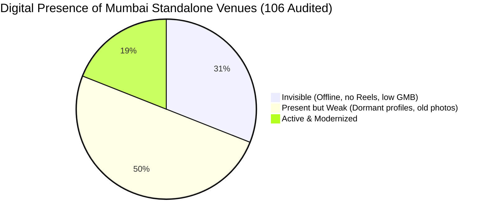
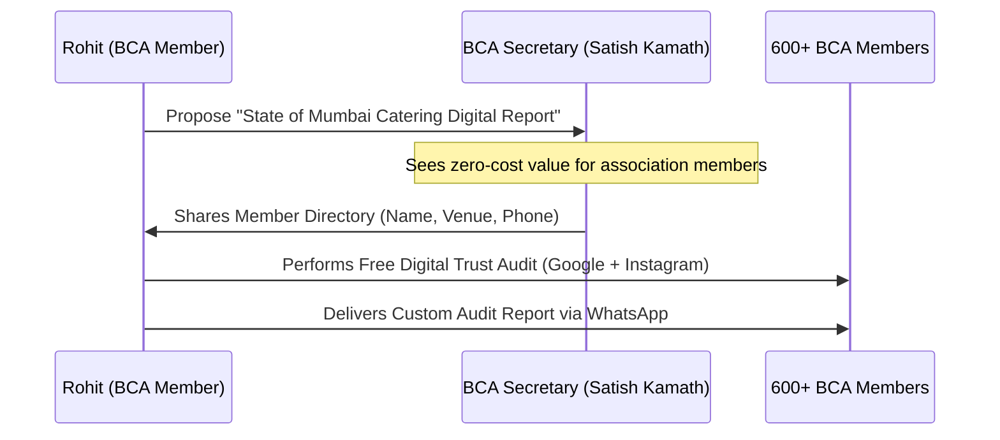

# BCDA Partnership Manual — Bombay Caterers Association & DigiVenue
**A Consolidated Master Guide on Co-Branded Advocacy, Strategic Data Sync, and Membership Recruitment**

---

## SECTION 1: Executive Summary — The Silent Revenue Leak

The modern Indian wedding discovery journey has moved entirely online:
$$\text{Instagram Reels} \longrightarrow \text{Google Maps Search} \longrightarrow \text{Google Reviews} \longrightarrow \text{Direct WhatsApp Inquiry} \longrightarrow \text{Booking}$$

While Mumbai's standalone banquet halls, lawns, and caterers excel in physical hospitality, they are digitally silent. When a family scrolls a venue's page at 11 PM and finds a dormant profile, they assume the business is inactive and quietly move on. **Operators only see their actual bookings—they never see the enquiries they lose silently online.**

This manual details the co-branded **Bombay Caterers Digital Analysis (BCDA)** initiative, helping the 600+ BCA members reclaim their direct bookings and helping the association recruit from Mumbai's 4,000+ unregistered operators.

---

## SECTION 2: BCDA Industry Report — The Internet Baseline

We conducted a public internet audit of **106 independent, standalone banquet halls, wedding lawns, and caterers** across Mumbai Suburbs, Central Mumbai, Thane, Navi Mumbai, and Pune to establish a baseline of the industry's digital health.



### Key Findings:
* **Total Venues Audited:** 106
* **Average Google Reviews per Venue:** 92 reviews (indicates high physical activity but low client review-collection habits).
* **The Gaps Discovered:**
  1. **31% of Venues are "Invisible" (33/106):** They do not show up consistently on Google Maps, have less than 15 total reviews, and have zero active Instagram presence.
  2. **50% of Venues are "Present but Weak" (53/106):** They have a Google Business listing or Instagram account, but it is dormant (no posts in 90+ days, no video/reels content, and low-res photos).
  3. **Only 19% of Venues are "Active" (20/106):** They post reels weekly, respond to reviews, and have a clear WhatsApp booking CTA.

> [!IMPORTANT]
> **81% of standalone, mid-market wedding venues and caterers in Mumbai are losing direct bookings** because they lack a basic, active online trust presence. They are forced to rely on expensive third-party commission portals.

---

## SECTION 3: The Top-Down Pitch — Official BCA Technology Partnership

Do **not** approach the secretary (Satish Kamath) asking for member data to sell software. Instead, pitch a co-branded modernization project.

```
[BCA's Core Problem] 
Aggregators dominate local SEO -> Members pay 15-20% commissions -> Profits shrink.

[DigiVenue's Solution]
Empower members to build direct digital trust -> Disintermediate portals -> Keep profits local.
```

### What the Partnership Looks Like:
1. **Co-Branded "BCA Digital Trust Audits":** 
   * DigiVenue becomes the official audit engine for the association.
   * "BCA members get a free quarterly Online Trust Analysis ($100 value) to see if they are losing bookings to portals."
2. **BCA Expo Integration:**
   * Secure a premium, official slot at the annual *Catering & Decor Expo*.
   * Run live website and Instagram audits for members at a dedicated "DigiVenue Digital Clinic" booth.
3. **Official Seal of Endorsement:**
   * Place the "Official Technology Partner of Bombay Caterers Association" badge on the DigiVenue website to build massive local trust.

---

## SECTION 4: BCA Internal Network Strategy & Data Acquisition

To connect with the 600+ members, you need their contact details. You can acquire this list officially through the committee using a **"Give-to-Get"** model:



### The "State of the Industry Report" Play:
* **The Pitch to Satish Kamath:** "I want to compile the first *'State of Mumbai Catering Digital Presence Report'* at my own cost. I will audit all 600 members' Google Listings and Instagram pages to show the association where we are strong and where we are losing business to portals. To do this, I need the member database (names, phone numbers, and business names) so we can run the audits. The final report will be co-published with BCA."

### Data Enrichment & Predictive Sales Mapping
Once the official member database is acquired from the committee, it is not merely audited for public links. The roster is ingested directly into Stage 2 of the DigiVenue Predictive Industry Engine (detailed in [operational_playbook.md](file:///c:/Users/rohit/Downloads/DigiStories/operational_playbook.md#SECTION-5-The-DigiVenue-Predictive-Industry-Engine-Stages-1-3)). 

Here, we layer relationship graphs, operator generations, and specific pain signals (operational bottlenecks, agency dissatisfaction) over their public Digital Maturity Index. This allows us to run highly targeted, predictive outreach rather than blind cold calls.

---

## SECTION 5: BCA Membership Recruitment Engine (The Growth Carrot)

There are 5,000+ caterers and 1,000+ banquets in Mumbai, but BCA currently represents only 600 (~10% market share). The ultimate pitch to become BCA's official partner is showing the committee how **DigiVenue will help double BCA's membership roster**.

```
[Unregistered Caterers]
Struggling to find bookings -> Low visibility online -> Open to business help.

[The Hook]
DigiVenue runs co-branded audits -> "Join BCA to unlock free digital upgrades & SmartOS."
```

### The Membership Expansion Strategy:

#### 1. Co-Branded "Mumbai Catering Modernization Campaign"
* DigiVenue and BCA launch a joint marketing campaign targeted at the 4,400+ unregistered caterers and 400+ unregistered banquets.
* **The Outreach:** We send them a co-branded audit: 
  > *"We reviewed your online catering listing as part of the **BCA Mumbai Modernization Drive**. Your business scored 30/100 (Invisible).*
  > 
  > *To unlock your full digital report, setup guidance, and a 3-month free trial of the SmartOS catering calendar, register as a BCA member today."*

#### 2. The "Member-Get-Member" Tech Perk
* Existing BCA members who refer a new member to BCA get a **15% discount on DigiStories** management or **SmartOS** licenses.

#### 3. Joint Zonal Workshops (The Dadar, Thane, Vashi Seminars)
* BCA and DigiVenue host monthly local seminars: *"How to Win Direct Wedding Bookings."*
* **Access Rules:** Free for BCA members; ₹500 entry fee for non-members (completely waived if they sign up for BCA membership at the registration desk).
* This provides BCA with a constant stream of new membership dues while positioning DigiVenue as the default technology infrastructure.
