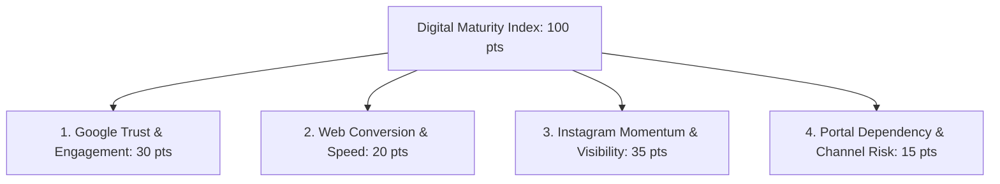
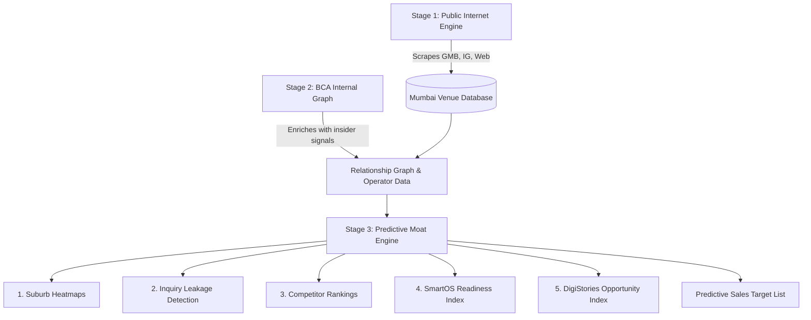
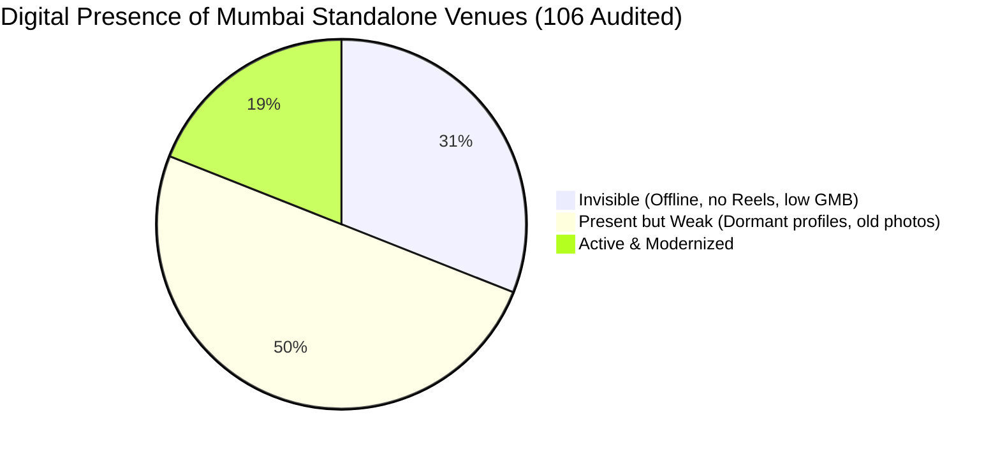
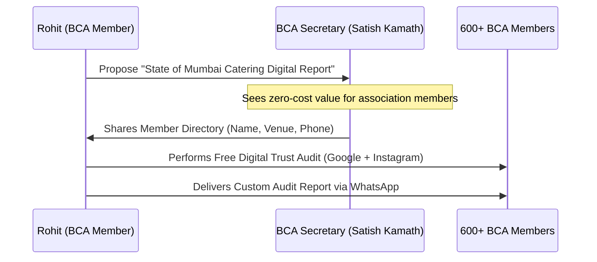

# Mumbai Catering Modernization Master Playbook

**A Unified Strategic Guide on Strategy, Digital Auditing, Institutional Partnership, and Product Integration**

---

## SECTION 1: The 5-Layer Operational Architecture

To successfully onboard the catering and banquet ecosystem, we deploy a five-tier architecture that moves from anonymous web intelligence to co-branded institutional endorsement, culminating in direct commercial conversion.

| Layer | Focus Area | Core Operational Mechanism |
| :--- | :--- | :--- |
| **Layer 1** | **Public Internet Intelligence** | Large-scale mapping of all 1,000+ banquets and 5,000+ caterers across Mumbai suburbs using automated web and social audits. |
| **Layer 2** | **BCA Member Intelligence** | Official integration with the BCA registry, layering operational data (diary styles, waitstaff limits) over their public web profiles. |
| **Layer 3** | **Industry Benchmarking** | Computing the **Digital Maturity Index (DMI)** to show members exactly where they stand compared to local competitors. |
| **Layer 4** | **Controlled Member Outreach** | Soft, peer-to-peer WhatsApp delivery of personalized audit snapshots from a fellow member, keeping it educational rather than sales-y. |
| **Layer 5** | **Commercial Conversion** | Natural introduction of **DigiStories** to resolve the marketing gaps and **SmartOS** to eliminate the operational chaos. |

---

## SECTION 2: The Deep-Dive Digital Maturity Index (DMI)

We calculate each operator's DMI score using a 100-point multi-dimensional rubric that measures both customer-facing trust and operational leak points.



### Dimension 1: Google Trust & Engagement (GTE) — Max 30 Points
* **Review Volume & Rating (10 pts):** Baseline market popularity score.
* **Review Freshness (5 pts):** Latest review posted < 7 days ago = 5 pts; < 30 days = 3 pts; > 90 days = 0 pts (signals to families if the venue is currently active).
* **Owner Response Rate (5 pts):** Replies to >80% of reviews = 5 pts; replies to some = 2 pts; no replies = 0 pts (shows customer care).
* **Photo Quality & Setup Diversity (5 pts):** >100 professional photos of empty vs. full decorated setups = 5 pts; only low-res guest uploads = 1 pt.
* **Category Optimization (5 pts):** Correct primary and secondary categories (e.g., "AC Banquet Hall", "Wedding Lawn").

### Dimension 2: Web Conversion & Speed (WCS) — Max 20 Points
* **Mobile Speed & Load Optimization (5 pts):** Loads in <3 seconds on mobile data without layout shifts.
* **Frictionless Booking Form (5 pts):** Simple fields with auto-fill support (no multi-page forms).
* **Floating WhatsApp CTA (5 pts):** Persistent bubble with a pre-filled template.
* **Transparency & Visual Freshness (5 pts):** Starts-from pricing shown, with real wedding gallery shoots instead of stock photos.

### Dimension 3: Instagram Momentum & Visibility (IVM) — Max 35 Points
* **Video/Reel Freshness & Frequency (10 pts):** Reel posted < 7 days ago = 10 pts; weekly consistency = 5 pts; dormant > 30 days = 0 pts.
* **Video Authenticity (10 pts):** Real wedding walkthroughs and decor setups = 10 pts; stock templates or text flyers = 2 pts.
* **Audience Engagement & Reach (5 pts):** Ratio of view counts to followers (shows organic health).
* **Profile Optimization (10 pts):** Bio CTA booking link, WhatsApp integration, and organized Highlights (e.g., "Halls", "Decor", "Menu", "Reviews").

### Dimension 4: Portal Dependency & Channel Risk (PDC) — Max 15 Points
* **Portal Dependency (5 pts):** Ranks via WedMeGood/WeddingWire but lacks direct organic ranking = 0 pts; ranks independently = 5 pts.
* **Facebook Activity (5 pts):** Active Facebook page (critical for older operators and family decision-makers) = 5 pts; dead page = 1 pt.
* **Cross-Channel Brand Consistency (5 pts):** Identical logos, phone numbers, and names across GMB, IG, Web, and Portals.

---

## SECTION 3: Phase 1 Operational Playbook (Manual + AI-Assisted)

**Objective:** Map your first 200 venues/caterers using a Virtual Assistant (VA) and simple sheets. Do not spend time coding API integrations until you have validated your sales pitch.

### Google Sheets / Airtable Database Schema (Column Structure)
Create a Google Sheet with the following exact columns. This matches the format generated by our [mumbai_banquet_scraping_engine.py](file:///c:/Users/rohit/Downloads/DigiStories/mumbai_banquet_scraping_engine.py) later.

| Column Letter | Header Title | Description / Validation | Data Type |
| :--- | :--- | :--- | :--- |
| **A** | **Venue/Caterer Name** | Official trade name. | Text |
| **B** | **Area / Suburb** | E.g., Dadar, Chembur, Vashi, Thane West. | Text |
| **C** | **Owner / POC Name** | Name of the founder/manager (find via website/LinkedIn). | Text |
| **D** | **WhatsApp Number** | Active mobile number (format: +91 XXXXX XXXXX). | Number |
| **E** | **Google Maps Link** | Direct URL to their Google Business Profile. | URL |
| **F** | **GMB Review Count** | Total number of Google reviews. | Number |
| **G** | **GMB Rating** | Average rating (e.g., 4.2). | Decimal |
| **H** | **Instagram Link** | URL to their Instagram page. | URL |
| **I** | **IG Post Frequency** | "Weekly", "Dormant (>30 days)", or "None". | Dropdown |
| **J** | **Website Link** | Website URL (or mark "None"). | URL |
| **K** | **Booking Diary Style** | "Paper Book", "Excel Sheet", or "SmartOS (Target)". | Dropdown |
| **L** | **DMI Score** | Computed using the ChatGPT prompt below. | Number (0-100) |
| **M** | **Target Tier** | Tier A (Active), Tier B (Weak), Tier C (Invisible). | Dropdown |

### Virtual Assistant (VA) Standard Operating Procedure (SOP)
* **Step 1 (Maps):** Search maps for *"banquet hall in [Suburb]"* (e.g., Dadar). Log name, rating, address, website, and total reviews.
* **Step 2 (Website):** Click website link. Extract email, phone number, and look for Instagram/Facebook links.
* **Step 3 (Instagram):** Open their Instagram handle. Check if they have posted a Reel in the last 7 days. Check if their bio contains a direct WhatsApp CTA.
* **Step 4 (AI Score):** Copy these details, paste them into the ChatGPT DMI Prompt below, and log the output.

### The ChatGPT DMI Scoring & Pitch Prompt
Give your VA this prompt to copy-paste into ChatGPT when auditing a lead:

```text
You are the DigiVenue Digital Analyst. Calculate the Digital Maturity Index (DMI) for this venue out of 100 based on these metrics:

1. Instagram Activity (Max 20): 18 if posting weekly, 10 if dormant, 0 if no account.
2. Reel Consistency (Max 10): 8 if regular video walkthroughs, 3 if static images only, 0 if none.
3. Google Reviews (Max 20): 16 if reviews > 50, 12 if reviews 10-50, 5 if <10. Add +4 bonus if rating >= 4.4.
4. Inquiry Conversion CTA (Max 15): 12 if has direct booking link/WhatsApp CTA, 0 if none.
5. Website Quality (Max 10): 8 if mobile-optimized with forms, 4 if slow/outdated layout, 0 if no site.
6. WhatsApp Integration (Max 10): 8 if wa.me link exists, 0 if none.
7. Brand Consistency (Max 5): 4 if design matches across site/IG, 1 if messy.
8. Response Structure (Max 10): 8 if auto-reply exists, 2 if completely manual.

Inputs to score:
- Venue Name: [Input Venue Name]
- Area: [Input Area]
- GMB Reviews: [Input count] (Rating: [Input rating])
- Instagram handle: [Input handle/None]
- Website link: [Input link/None]
- WhatsApp link: [Input link/None]

Output format:
1. Score Breakdown (list scores for the 8 categories).
2. Total Score (/100) and Tier (Tier A: >=65, Tier B: 35-64, Tier C: <35).
3. Personalized WhatsApp Outreach Script using Rohit Nate (Dadar BCA member) peer-to-peer tone.
```

---

## SECTION 4: Scaling to Phase 2 (Semi-Automation) & Phase 3 (Platform)

* **Phase 2 (Semi-Automation):** 
  Transition from manual logging to running the [mumbai_banquet_scraping_engine.py](file:///c:/Users/rohit/Downloads/DigiStories/mumbai_banquet_scraping_engine.py) script. This automates Google Places detail scraping, website parsing for phone/social links, and DMI calculations. Save the outputs directly to Airtable/HubSpot and color-code leads based on DMI tiers.
* **Phase 3 (Full Platform Moat):** 
  Integrate your data directly into **SmartOS**. Create a public "Online Trust Map" of Mumbai's wedding venues. Non-members visit the map, find their venue pinned in Red (Invisible), and click to claim their profile. SmartOS will automatically suggest GMB reply templates and Instagram Reels ideas based on active competitors' data.

---

## SECTION 5: The DigiVenue Predictive Industry Engine (Stages 1-3)

To move beyond manual audits and random sales calls, DigiVenue utilizes a three-stage predictive engine. This engine transforms public signals and proprietary network data into actionable, high-probability sales targets.



### Stage 1 — Public Internet Mapping Engine (Discovery)
The entry point of our pipeline is a semi-automated discovery system that maps the entire wedding and event vendor ecosystem in Mumbai.
* **The Goal:** Build and maintain the largest structured database of banquets (1000+), caterers (5000+), decorators (2000+), lawns (300+), and hall venues (500+) in Mumbai.
* **Core Collection Stack:**
  * **Google Places Scanner:** Automatically queries location APIs suburb-by-suburb (e.g., Dadar, Chembur, Andheri, Thane) using targeted queries like "AC banquet hall", "marriage hall", "outdoor catering".
  * **Website & Social Crawler:** Crawls extracted URLs to isolate contact details, identify Instagram and Facebook profile page handles, and verify if floating CTAs (e.g., WhatsApp chat bubbles) are active.
  * **Continuous Updates:** Runs monthly to detect changes in reviews, rating drops, website downtime, or deactivated social handles.

### Stage 2 — BCA Internal Network Intelligence (Contextual Enrichment)
The Bombay Caterers Association (BCA) membership is our unfair advantage. By officially partnering with BCA, we enrich the public database with insider relationship graphs that external competitors cannot replicate.

Once inside the BCA network, we layer the following proprietary signals over our scraped GMB and Instagram profiles:

| Internal Signal | Why Valuable | Sales Translation |
| :--- | :--- | :--- |
| **2nd Generation Involved?** | Indicates a shift towards younger, tech-receptive decision-makers. | Faster adopter of modern booking systems. |
| **Multiple Venues?** | Shows a business that has scaled beyond a single venue. | High expansion potential (multi-property SmartOS license). |
| **Operational Complaints?** | Highlights booking overlaps, double-bookings, or coordinator friction. | Prime target for SmartOS booking calendar and guardrails. |
| **Vendor Dependencies?** | Maps which external decorators, sound systems, or caterers are tied to the venue. | Helps map the local ecosystem and target dependent vendors. |
| **Inquiry Handling Style?** | Detects if they use paper diaries, Excel sheets, or ignore off-hour inquiries. | Chaos detection; showcases direct conversion gaps. |
| **Peak Season Bottlenecks?** | Pinpoints dates where the venue struggles with guest count verification or menu adjustments. | High-pain season operational pitches. |
| **Existing Agency Dissatisfaction?** | Identifies if they are unhappy with high-fee portals or passive marketing agencies. | Low-friction opening for DigiStories visual presence packages. |

> [!TIP]
> **The Real Gold:** Combining these signals allows our sales team to instantly identify who is modernization-ready, who has high intent but leaks bookings, who is overspending on portals, and who is fully dependent on old reference channels.

### Stage 3 — The DigiVenue Industry Engine (Moat & Analytics)
Using the enriched database, the DigiVenue Engine calculates five proprietary indices that automate lead prioritization:
1. **Territory Heatmaps:** Maps suburbs where digital competition is weakest, helping venues see where they can dominate search easily.
2. **Inquiry Leakage Detection:** Pinpoints venues with high Google search impressions/reviews but dead social feeds or slow response times, indicating lost leads.
3. **Competitor Visibility Ranking:** Suburb-wise index of who dominates online discovery, creating a "fear of missing out" (FOMO) for low-ranking venues.
4. **SmartOS Readiness Ranking:** Scores operational complexity (number of halls, catering policy) to identify who will convert fastest.
5. **DigiStories Opportunity Index:** Flags premium-looking physical venues that have zero video presence, highlighting an urgent need for content modernization.

---

### The Power of Predictive Sales Outreach
By structuring this engine, our sales workflow transitions from cold, random outreach to high-conversion, predictive consulting.

* **Traditional Outreach (Inefficient):** *"Let's call 100 random banquets in Mumbai and ask if they need a website."*
* **Predictive Sales Outreach (High-Conversion):**
  > *"These 17 venues in Chembur have active inquiry demand, weak content systems, dead Google maps activity (no reviews in 60 days), poor response structure (no WhatsApp CTA), are run by second-generation operators, and have a 90% probability of converting to SmartOS."*

#### Conceptual Database Query for Sales Prioritization
To extract these high-probability leads, our CRM or database runs the following predictive query logic:

```sql
SELECT venue_name, phone_number, area, dmi_score
FROM mumbai_venues_intelligence
WHERE area = 'Chembur'
  AND dmi_score < 50
  AND has_second_gen_owner = TRUE
  AND booking_diary_style = 'Paper Book'
  AND (google_review_freshness_days > 60 OR instagram_post_frequency = 'Dormant')
ORDER BY dmi_score ASC;
```

---

## SECTION 6: The BCDA Executive Summary & Baseline Report

The modern Indian wedding discovery journey has moved entirely online:
$$\text{Instagram Reels} \longrightarrow \text{Google Maps Search} \longrightarrow \text{Google Reviews} \longrightarrow \text{Direct WhatsApp Inquiry} \longrightarrow \text{Booking}$$

While Mumbai's standalone banquet halls, lawns, and caterers excel in physical hospitality, they are digitally silent. When a family scrolls a venue's page at 11 PM and finds a dormant profile, they assume the business is inactive and quietly move on. **Operators only see their actual bookings—they never see the enquiries they lose silently online.**

We conducted a public internet audit of **106 independent, standalone banquet halls, wedding lawns, and caterers** across Mumbai Suburbs, Central Mumbai, Thane, Navi Mumbai, and Pune to establish a baseline of the industry's digital health.



### Key Findings:
* **Total Venues Audited:** 106
* **Average Google Reviews per Venue:** 92 reviews (indicates high physical activity but low client review-collection habits).
* **The Gaps Discovered:**
  1. **31% of Venues are "Invisible" (33/106):** They do not show up consistently on Google Maps, have less than 15 total reviews, and have zero active Instagram presence.
  2. **50% of Venues are "Present but Weak" (53/106):** They have a Google Business listing or Instagram account, but it is dormant (no posts in 90+ days, no video/reels content, and low-res photos).
  3. **Only 19% of Venues are "Active" (20/106):** They post reels weekly, respond to reviews, and have a clear WhatsApp booking CTA.

---

## SECTION 7: The Top-Down Pitch — Official BCA Partnership

Do **not** approach the secretary (Satish Kamath) asking for member data to sell software. Instead, pitch a co-branded modernization project.

```
[BCA's Core Problem] 
Aggregators dominate local SEO -> Members pay 15-20% commissions -> Profits shrink.

[DigiVenue's Solution]
Empower members to build direct digital trust -> Disintermediate portals -> Keep profits local.
```

### What the Partnership Looks Like:
1. **Co-Branded "BCA Digital Trust Audits":** 
   * DigiVenue becomes the official audit engine for the association.
   * "BCA members get a free quarterly Online Trust Analysis ($100 value) to see if they are losing bookings to portals."
2. **BCA Expo Integration:**
   * Secure a premium, official slot at the annual *Catering & Decor Expo*.
   * Run live website and Instagram audits for members at a dedicated "DigiVenue Digital Clinic" booth.
3. **Official Seal of Endorsement:**
   * Place the "Official Technology Partner of Bombay Caterers Association" badge on the DigiVenue website to build massive local trust.

---

## SECTION 8: BCA Internal Network Strategy & Data Acquisition

To connect with the 600+ members, you need their contact details. You can acquire this list officially through the committee using a **"Give-to-Get"** model:



### The "State of the Industry Report" Play:
* **The Pitch to Satish Kamath:** "I want to compile the first *'State of Mumbai Catering Digital Presence Report'* at my own cost. I will audit all 600 members' Google Listings and Instagram pages to show the association where we are strong and where we are losing business to portals. To do this, I need the member database (names, phone numbers, and business names) so we can run the audits. The final report will be co-published with BCA."

### Data Enrichment & Predictive Sales Mapping
Once the official member database is acquired from the committee, it is not merely audited for public links. The roster is ingested directly into Stage 2 of the DigiVenue Predictive Industry Engine (detailed in [SECTION 5](#SECTION-5-The-DigiVenue-Predictive-Industry-Engine-Stages-1-3)). 

Here, we layer relationship graphs, operator generations, and specific pain signals (operational bottlenecks, agency dissatisfaction) over their public Digital Maturity Index. This allows us to run highly targeted, predictive outreach rather than blind cold calls.

---

## SECTION 9: BCA Membership Recruitment Engine (The Growth Carrot)

There are 5,000+ caterers and 1,000+ banquets in Mumbai, but BCA currently represents only 600 (~10% market share). The ultimate pitch to become BCA's official partner is showing the committee how **DigiVenue will help double BCA's membership roster**.

```
[Unregistered Caterers]
Struggling to find bookings -> Low visibility online -> Open to business help.

[The Hook]
DigiVenue runs co-branded audits -> "Join BCA to unlock free digital upgrades & SmartOS."
```

### The Membership Expansion Strategy:

#### 1. Co-Branded "Mumbai Catering Modernization Campaign"
* DigiVenue and BCA launch a joint marketing campaign targeted at the 4,400+ unregistered caterers and 400+ unregistered banquets.
* **The Outreach:** We send them a co-branded audit: 
  > *"We reviewed your online catering listing as part of the **BCA Mumbai Modernization Drive**. Your business scored 30/100 (Invisible).*
  > 
  > *To unlock your full digital report, setup guidance, and a 3-month free trial of the SmartOS catering calendar, register as a BCA member today."*

#### 2. The "Member-Get-Member" Tech Perk
* Existing BCA members who refer a new member to BCA get a **15% discount on DigiStories** management or **SmartOS** licenses.

#### 3. Joint Zonal Workshops (The Dadar, Thane, Vashi Seminars)
* BCA and DigiVenue host monthly local seminars: *"How to Win Direct Wedding Bookings."*
* **Access Rules:** Free for BCA members; ₹500 entry fee for non-members (completely waived if they sign up for BCA membership at the registration desk).
* This provides BCA with a constant stream of new membership dues while positioning DigiVenue as the default technology infrastructure.

---

## SECTION 10: The Triangular Intelligence Loop (Scraper, Tool, & Bible Integration)

To connect the Discovery Scraper, Sales Tool, and Growth Bible, we connect them in an automated, self-reinforcing integration loop.

### Flow A: Scraper $\longrightarrow$ Sales Tool (Pre-population)
The scraper writes its output to `bcda_extracted_leads.json`. A JSON loading script in `digistories-sales-tool-v2.html` allows the representative to select any venue from a dropdown. It instantly auto-populates:
* Google rating and review count.
* Website URL and mobile optimization presence.
* Instagram handle and baseline DMI score.

### Flow B: Sales Tool $\longrightarrow$ Central Database (BCA Enrichment)
During the consultation, Rohit enriches the public profile with the verified BCA internal signals (operator generation, paper booking calendar, decorator royalties). This record exports back into the CRM, informing future scraper prioritizations.

### Flow C: Sales Tool & Database $\longrightarrow$ Growth Bible (Roadmap Generation)
Each failed checkpoint in the Sales Tool maps directly to a specific strategy section tag inside the **Venue Growth Bible** (`venue-growth-bible-engine.html`):

| Failed Checkpoint | Bible Target Anchor | Dynamic Strategy Delivered |
| :--- | :--- | :--- |
| **No Active Reels** | `#instagram-reels-recipes` | 5 cinematic luxury decor Reels templates. |
| **Low Review Count** | `#review-generation-loop` | Automated WhatsApp family feedback scripts. |
| **Paper Booking Diary** | `#smartos-transition-play` | Digital booking migration blueprints. |

Upon completing the call, the tool compiles only these matched strategies, generating a personalized 2-page print-friendly **"Banquet Digital Modernization Roadmap"** that is WhatsApped directly to the owner.
