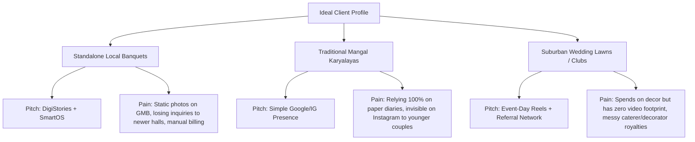

# DigiVenue — Standalone & Traditional Venues Client Database (100+ Local leads)

This database contains **106 local standalone banquet halls, wedding lawns, and traditional *mangal karyalayas* (marriage halls)** across DigiVenue's core target markets in Maharashtra (Mumbai, Thane, Navi Mumbai, and Pune).

All premium 5-star luxury hotels (Taj, St. Regis, Marriott, Hyatt, Conrad, etc.) have been excluded, as they utilize global corporate PR and social agencies. The targets below are **independent, owner-operated, or family-run hospitality businesses** that rely on offline diaries, local referrals, and are highly receptive to DigiStories' ₹15,000/month visual transformation and SmartOS inquiry management.

---

## 1. Targeting & Pitch Strategy Overview



### Ideal Client Profile (ICP) Filters:
* **Venue Type:** Standalone banquet halls, family-owned lawns, local social clubs, traditional community sabhagrihas, and mangal karyalayas.
* **Catering Plates:** ₹600 to ₹1,800 per plate (Mid-market segment).
* **Booking System:** Typically paper-based register diaries, offline spreadsheets, or simple WhatsApp logs.
* **Online Presence:** "Present but weak" or "Invisible" online (inactive Instagram, unoptimized Google listing, low-quality guest-uploaded photos).

---

## 2. Mumbai - South & Central (18 Venues)

Traditional local banquets, community halls, and independent venues in central Mumbai nodes.

| # | Venue Name | Area | Type | Est. Capacity | DigiVenue Fit & Pitch Strategy |
| :--- | :--- | :--- | :--- | :--- | :--- |
| 1 | Swagat Banquet Hall | Dadar | Standalone Banquet | 200 - 800 | *DigiStories + SmartOS:* High-demand local banquet. Has a dead Instagram page; needs walk-through reels and offline diary digitization. |
| 2 | Swatantryaveer Savarkar Sabhagriha | Shivaji Park | Standalone Hall | 300 - 1000 | *SmartOS:* Highly active local community hall; streamline traditional booking registers. |
| 3 | Kohinoor Hall | Dadar | Traditional Banquet | 200 - 700 | *DigiStories:* Landmark venue but has old, low-res Google photos. Capture real wedding setups. |
| 4 | Mayfair Banquets | Worli | Standalone Banquet | 150 - 800 | *DigiStories:* Independent premium banquet; needs high-quality aesthetic reels to compete with nearby 5-stars. |
| 5 | Jewel of India (Jade Ballroom) | Worli | Standalone Banquet | 200 - 1000 | *DigiStories + SmartOS:* Showcase luxury interiors and automate decorator commission tracking. |
| 6 | Ramee Guestline Banquets | Dadar | Mid-size Hotel Hall | 100 - 400 | *SmartOS:* Replace paper enquiry logs and automate quote sheet creation. |
| 7 | Ahilyadevi Sabhagruh | Dadar | Traditional Hall | 150 - 500 | *SmartOS:* Traditional venue; digitize booking receipts and calendars. |
| 8 | Lala Lajpatrai Hall | Mahalaxmi | Standalone Hall | 200 - 800 | *DigiStories:* Showcase sea-breeze proximity and large indoor layouts. |
| 9 | Royal Symphony Banquet | Dadar | Standalone Banquet | 100 - 500 | *DigiStories:* Focus on budget-friendly wedding sangeet reels. |
| 10 | Dadar Gymkhana Banquets | Shivaji Park | Club Hall | 200 - 1000 | *SmartOS:* Manage club-member priority bookings and track security deposits. |
| 11 | Sharda Sabhagriha | Dadar | Traditional Hall | 100 - 400 | *SmartOS:* Ditch offline book register and move to digital booking calendars. |
| 12 | P. L. Deshpande Mini Hall | Prabhadevi | Govt/Private Hall | 150 - 500 | *SmartOS:* High occupancy tracking and automatic invoice generation. |
| 13 | Maharashtra College Hall | Byculla | Community Hall | 300 - 1200 | *SmartOS:* Streamline traditional catering logs and venue rentals. |
| 14 | Bombay Y.M.C.A. Banquets | Colaba | Club Hall | 100 - 400 | *SmartOS:* Manage budget event bookings and payment tracking. |
| 15 | Royal Garden Banquet | Dadar | Standalone Banquet | 100 - 600 | *DigiStories:* Revive their inactive social media with professional decorator reels. |
| 16 | Hindu Gymkhana Grounds | Marine Drive | Club Lawn | 500 - 2500 | *DigiStories:* Drone shots of grand Marine Drive mandaps to showcase scale online. |
| 17 | Parsi Gymkhana Grounds | Marine Drive | Club Lawn | 400 - 2000 | *DigiStories:* Capture sunset oceanfront wedding decor setups. |
| 18 | Wodehouse Gymkhana Banquets | Colaba | Club Hall | 100 - 500 | *SmartOS:* Automate guest bookings and membership discounts. |

---

## 3. Mumbai - Suburbs (28 Venues)

Dense residential areas with high competition among independent, family-owned halls.

| # | Venue Name | Area | Type | Est. Capacity | DigiVenue Fit & Pitch Strategy |
| :--- | :--- | :--- | :--- | :--- | :--- |
| 19 | Vivette Luxury Banquets | Malad West | Standalone Banquet | 200 - 1000 | *DigiStories:* Gorgeous physical venue but lacks a consistent video presence. Showcase chandelier views. |
| 20 | Evershine Banquets | Malad West | Standalone Banquet | 300 - 1500 | *DigiStories + SmartOS:* Spends crores on decor; needs reel walkthroughs and SmartOS to manage high-volume bookings. |
| 21 | Merchant Banquet Hall | Malad West | Standalone Banquet | 150 - 600 | *SmartOS:* Enforce strict policy tracking (music/catering rules) in digital booking contracts. |
| 22 | Golden Leaf Banquet | Malad West | Standalone Banquet | 200 - 1000 | *DigiStories:* Run localized Instagram campaigns to highlight their veg catering packages. |
| 23 | Royal Orchid Banquets | Chembur | Standalone Banquet | 100 - 600 | *DigiStories + SmartOS:* Highly active local spot; needs transition from paper book to SmartOS. |
| 24 | The Acres Club | Chembur | Club / Banquet | 150 - 800 | *SmartOS:* Streamline member rates, decorator approvals, and catering billing. |
| 25 | GCC Hotel and Club | Mira Road | Resort / Lawn | 300 - 2500 | *SmartOS + DigiStories:* Sprawling local resort; requires multi-lawn booking calendar and active reels. |
| 26 | Juhu Club Millennium | Juhu | Club / Lawn | 200 - 1500 | *SmartOS:* Automate booking contracts and manage vendor royalty lists. |
| 27 | Goldfinch Banquets | Andheri East | Mid-size Hotel Hall | 100 - 600 | *SmartOS:* Capture mid-budget business-to-wedding enquiries. |
| 28 | Tunga Paradise Banquet | Andheri East | Mid-size Hotel Hall | 100 - 400 | *SmartOS:* Standardize quotation templates and inquiry logs. |
| 29 | VITS Hotel Banquets | Andheri East | Mid-size Hotel Hall | 150 - 800 | *SmartOS:* Manage multiple party hall dates and catering options. |
| 30 | Peninsula Grand Banquets | Sakinaka | Standalone Banquet | 200 - 1000 | *DigiStories:* Highlight premium look online to win local airport-proximity wedding leads. |
| 31 | Kohinoor Continental Banquets | Andheri East | Hotel Hall | 100 - 500 | *SmartOS:* Streamline pre-wedding booking contracts. |
| 32 | Swagat Banquet Hall | Goregaon | Standalone Hall | 100 - 500 | *DigiStories:* Replace low-res phone photos on Google Maps with professional empty/full shots. |
| 33 | Imperial Hall | Ghatkopar | Standalone Hall | 150 - 600 | *DigiStories + SmartOS:* Target local Gujarati/Marwari wedding planners with dynamic reels. |
| 34 | Royal Symphony Banquet | Malad East | Standalone Banquet | 100 - 500 | *SmartOS:* Track client deposits and decorator payouts automatically. |
| 35 | Elegance Banquet | Borivali | Standalone Banquet | 150 - 800 | *DigiStories:* Showcase their modern LED wall setups in sangeet reels. |
| 36 | Sumati Hall | Ghatkopar East | Standalone Hall | 100 - 450 | *SmartOS:* Traditional hall; move booking registers to digital layout. |
| 37 | Utsav Banquet Hall | Bhandup | Standalone Banquet | 100 - 500 | *DigiStories:* Highlight local visibility to outshine newly opened competitors. |
| 38 | Dreamland Banquet Hall | Bhandup | Standalone Hall | 150 - 600 | *SmartOS:* Automate WhatsApp booking confirmations to clients. |
| 39 | The Gateway Banquet | Mulund West | Standalone Banquet | 200 - 1000 | *DigiStories:* Showcase modern floral decor setups in high-engagement Instagram posts. |
| 40 | Shehnai Banquet Hall | Mulund East | Standalone Hall | 100 - 600 | *SmartOS:* Replace paper calendar with digital dashboard to prevent double-booking. |
| 41 | Blossom Banquet Hall | Kurla | Standalone Hall | 100 - 500 | *SmartOS:* Simplify invoice creation and track supplier payouts. |
| 42 | Club Emerald Banquets | Chembur | Club Hall | 150 - 600 | *SmartOS:* Manage club booking dates and caterer payments. |
| 43 | GCC Club Lawn | Mira Road | Wedding Lawn | 400 - 2000 | *DigiStories:* Drone shots of grand lawns and sunset setups. |
| 44 | Sapphire Banquet | Kanjurmarg | Standalone Banquet | 100 - 600 | *DigiStories:* Localized social ads for eastern suburb budget weddings. |
| 45 | Grand Banquet at The Club | Andheri West | Club Hall | 200 - 800 | *SmartOS:* Automate decorator permissions and track security deposits. |
| 46 | Eskay Resorts Lawn | Borivali West | Resort Lawn | 500 - 3000 | *DigiStories:* Sprawling open-air lawns; showcase grandeur in cinematic reels. |

---

## 4. Thane & Kalyan-Dombivli (20 Venues)

High-volume wedding markets with large local standalone banquets and *mangal karyalayas*.

| # | Venue Name | Area | Type | Est. Capacity | DigiVenue Fit & Pitch Strategy |
| :--- | :--- | :--- | :--- | :--- | :--- |
| 47 | Hotel Tip Top Plaza | Thane West | Standalone Multiplex| 100 - 2500 | *SmartOS + DigiStories:* Landmark venue with 10+ halls. High-priority for SmartOS multi-hall booking management. |
| 48 | iLeaf Ritz Banquets | Thane West | Standalone Banquet | 200 - 1500 | *DigiStories:* Ultra-premium interiors; needs high-quality walk-through reels to command premium pricing. |
| 49 | Satkar Grand Banquets | Thane West | Standalone Banquet | 150 - 1000 | *DigiStories + SmartOS:* Transition from offline paper diaries to prevent booking overlaps. |
| 50 | Madhav Banquet | Thane West | Standalone Banquet | 200 - 1200 | *DigiStories:* Highlight large pillarless hall design in drone-style video reels. |
| 51 | All Heavens Banquet | Thane West | Standalone Banquet | 100 - 500 | *DigiStories:* Focus on budget-friendly intimate wedding packages. |
| 52 | Maharaja Banquet | Ghodbunder Rd | Standalone Banquet | 150 - 800 | *DigiStories:* Showcase their rooftop layout and sunset views. |
| 53 | Exotica Yeoor Hills | Yeoor Hills | Nature Resort | 150 - 800 | *DigiStories:* Forest backdrop; showcase outdoor pool parties and twilight wedding setups. |
| 54 | Bramha Banquet | Thane West | Standalone Banquet | 100 - 600 | *DigiStories:* Drive local social ads to beat out nearby competitors. |
| 55 | Symphony Banquet | Thane West | Standalone Banquet | 100 - 500 | *SmartOS:* Automate booking contracts and track deposit updates. |
| 56 | Korum Mall Banquets | Eastern Exp Hwy| Standalone Banquet | 150 - 800 | *SmartOS:* Manage high walk-in inquiry tracking from mall visitors. |
| 57 | Regency Hall | Kalyan | Standalone Banquet | 200 - 1000 | *SmartOS + DigiStories:* Kalyan market leader; run localized social campaigns and digitize offline calendars. |
| 58 | Springtime Club | Kalyan | Club Hall & Lawn | 200 - 1500 | *SmartOS:* Manage club-member booking prioritizations and decorator payouts. |
| 59 | Guru Nanak Darbar Banquet | Thane East | Standalone Hall | 100 - 600 | *SmartOS:* Community venue; replace manual logs with digital calendars. |
| 60 | Shangrila Resort | Bhiwandi Road | Resort / Lawn | 300 - 2000 | *DigiStories:* Highlight waterpark/wedding packages in social posts. |
| 61 | Shaurya Banquet | Thane West | Standalone Banquet | 150 - 800 | *DigiStories:* Capture real wedding decor highlights to keep page fresh. |
| 62 | Royal Banquet Hall | Kalyan | Standalone Hall | 100 - 500 | *SmartOS:* Streamline traditional catering logs. |
| 63 | K. P. Banquet | Thane West | Standalone Banquet | 100 - 600 | *SmartOS:* Track decorator commission logs and deposits. |
| 64 | Nisarg Lawn & Banquet | Kalyan | Lawn & Banquet | 300 - 1500 | *DigiStories:* Showcase sprawling open lawns in sunset reels. |
| 65 | Savitri Banquet Hall | Dombivli | Standalone Hall | 100 - 600 | *SmartOS:* Traditional local hall; digitize paper booking logs. |
| 66 | Golden Palace Banquet | Dombivli | Standalone Hall | 150 - 800 | *SmartOS:* Run automatic WhatsApp follow-ups for inquiries. |

---

## 5. Navi Mumbai (20 Venues)

Standalone halls and party lawns located in Navi Mumbai's commercial and residential nodes.

| # | Venue Name | Area | Type | Est. Capacity | DigiVenue Fit & Pitch Strategy |
| :--- | :--- | :--- | :--- | :--- | :--- |
| 67 | iLeaf Grand Banquets | Vashi | Standalone Banquet | 200 - 1200 | *DigiStories:* Navi Mumbai's top standalone venue. Spends heavily on decor; needs daily aesthetic reels. |
| 68 | Grand Golden Banquet | Vashi | Standalone Banquet | 150 - 1000 | *DigiStories:* Focus on showcasing their premium Palm Beach Road location online. |
| 69 | Imperial Banquets | Vashi | Standalone Banquet | 100 - 800 | *SmartOS:* Manage high volume booking calendars and automate billing. |
| 70 | Palm Beach Lawn & Banquets | Sanpada | Lawn & Hall | 300 - 2000 | *DigiStories:* Showcase the open-air lawn sunset vibe in social reels. |
| 71 | Vidhi Banquets | Kopar Khairane | Standalone Banquet | 100 - 600 | *SmartOS:* Streamline traditional family booking records and deposit sheets. |
| 72 | Gems Party Hall | Vashi | Standalone Banquet | 100 - 500 | *DigiStories:* Showcase grand entryway design and royal-style wedding stages. |
| 73 | Golden Peacock Banquet | Kharghar | Standalone Banquet | 100 - 800 | *SmartOS:* Track catering options and automate client GST invoices. |
| 74 | Panvel Grand Banquet | Panvel | Standalone Banquet | 150 - 1000 | *SmartOS + DigiStories:* Panvel hub leader; run localized social campaigns for local couples. |
| 75 | Ashoka Banquet Hall | Vashi | Standalone Hall | 100 - 600 | *DigiStories:* Replace low-res GMB photos with empty vs decorated walkthroughs. |
| 76 | Moraj Banquet Hall | Sanpada | Standalone Hall | 100 - 500 | *SmartOS:* Replace paper calendar with digital dashboard to log bookings. |
| 77 | Belapur Garden Banquet | Belapur | Lawn & Banquet | 200 - 1200 | *DigiStories:* Highlight tropical lawn themes in sangeet and reception reels. |
| 78 | Shubham Karoti Banquet | Kopar Khairane | Standalone Hall | 100 - 600 | *SmartOS:* Traditional hall; digitize billing and deposits. |
| 79 | Kesar Banquet | Kharghar | Standalone Banquet | 100 - 500 | *DigiStories:* Beat local competitors with geo-targeted Instagram Reels. |
| 80 | Vishwa Jyot Banquet | Kharghar | Standalone Hall | 100 - 600 | *SmartOS:* Track multi-booking days and automate invoices. |
| 81 | Royal Celebration Hall | Kamothe | Standalone Hall | 100 - 500 | *SmartOS:* Automate WhatsApp intake forms for walk-in queries. |
| 82 | Celebration Banquet Hall | Nerul | Standalone Banquet | 100 - 600 | *SmartOS:* Manage local decorator approvals and payments. |
| 83 | Raigad Fort Banquet | New Panvel | Standalone Hall | 150 - 800 | *SmartOS:* Simplify traditional community hall bookings. |
| 84 | Shikara Hotel Banquets | Sanpada | Traditional Resort | 100 - 800 | *DigiStories:* Kashmiri themed; showcase unique lake and boat wedding setups in reels. |
| 85 | Belapur Gymkhana Banquets | Belapur | Club Hall | 150 - 800 | *SmartOS:* Manage club member bookings and discount schedules. |
| 86 | Navi Mumbai Club Banquets | Nerul | Club Hall & Lawn | 200 - 1200 | *SmartOS:* Track coordinator royalties and booking schedules. |

---

## 6. Pune & Outskirts (20 Venues)

IT-hub corridor venues, local family lawns, and highly popular traditional *mangal karyalayas*.

| # | Venue Name | Area | Type | Est. Capacity | DigiVenue Fit & Pitch Strategy |
| :--- | :--- | :--- | :--- | :--- | :--- |
| 87 | Siddhi Gardens & Banquets | Erandwane | Lawn & Hall | 200 - 1500 | *SmartOS:* Established central Pune location; streamline high-density wedding calendar. |
| 88 | Raaga Heritage Banquets | Hinjewadi | Lawn & Hall | 300 - 2000 | *DigiStories + SmartOS:* Sprawling IT-corridor venue; target IT couples with active Instagram reels. |
| 89 | Navyug Banquet Hall | Boat Club Rd | Standalone Banquet | 100 - 600 | *DigiStories:* Showcase their rooftop terrace setup in high-quality reels. |
| 90 | Emerald Party Hall | Baner | Standalone Banquet | 100 - 500 | *SmartOS:* Ditch the offline register; digitize booking receipts and schedules. |
| 91 | Pyramids Garden | Kothrud | Standalone Lawn | 300 - 1500 | *DigiStories:* Open-air lawn; capture twilight sangeet decoration walkthroughs. |
| 92 | Shubharambh Lawns | Karve Nagar | Lawn & Banquet | 300 - 2000 | *DigiStories:* Run active reels to showcase large capacity and parking amenities. |
| 93 | Oasis Banquets & Lawns | Hadapsar | Lawn & Hall | 200 - 1200 | *SmartOS:* Track multiple decorators and caterer schedules. |
| 94 | Yash Lawns | Bibwewadi | Sprawling Lawn | 500 - 3000 | *DigiStories:* Capture drone footage of mega weddings to showcase scale. |
| 95 | Raga Lawns | Koregaon Park | Standalone Lawn | 300 - 1500 | *DigiStories:* Target trendy, high-aesthetic outdoor events via Instagram. |
| 96 | Saket Banquets | Erandwane | Standalone Banquet | 100 - 600 | *SmartOS:* Automate quote generation and client GST invoicing. |
| 97 | Abhishek Veg Banquet | Kothrud | Standalone Hall | 100 - 500 | *SmartOS:* Highly active veg-only hall; streamline high-volume local bookings. |
| 98 | Gandharva Lawns | Pimple Saudagar | Lawn & Hall | 200 - 1200 | *DigiStories:* Revive their dead Instagram feed to win local suburban queries. |
| 99 | Royal Lawns | Baner | Standalone Lawn | 300 - 1500 | *DigiStories:* Open-air wedding setups; capture aesthetic reels for evening functions. |
| 100| Laxmi Lawns | Magarpatta | Sprawling Lawn | 500 - 4000 | *DigiStories:* Drone reels to emphasize grand space and parking capacity. |
| 101| Shrushti Lawns | DP Road | Lawn & Hall | 250 - 1200 | *SmartOS:* Simplify decorator payouts and manage booking timelines. |
| 102| Balaji Banquets | Wakad | Standalone Banquet | 100 - 600 | *SmartOS:* Replace manual diary system with digital enquiry boards. |
| 103| Vardhaman Lawns | Gangadham | Traditional Lawn | 300 - 2000 | *SmartOS:* Track deposits and manage decorator commission logging. |
| 104| Sai Palace Banquets | Wakad | Standalone Banquet | 150 - 800 | *DigiStories:* Target local IT professional queries with active Instagram reels. |
| 105| Nisarg Mangal Karyalaya | Erandwane | Mangal Karyalaya| 200 - 1000 | *SmartOS + DigiStories:* Ultra-traditional venue; replace offline book register and establish basic GMB listing. |
| 106| Alpa Bachat Bhavan | Camp | Standalone Venue | 300 - 2000 | *SmartOS:* High occupancy hall booking system; requires structured digital calendar. |

---

## 7. Recommended Action Plan for Sales Outreach

```
[Phase 1: Local Digital Audit]
Verify Instagram & Google Maps profiles for these 106 targets. Identify the ones with no reels or old photos.

[Phase 2: The "Reality Check" Pitch]
Send them a WhatsApp screenshot of their dead profile next to their competitor's active profile (e.g., using the DigiStories audit tool).

[Phase 3: SmartOS Demo]
Show owners how they can throw away their physical registers and run bookings directly on their phone using SmartOS.
```
