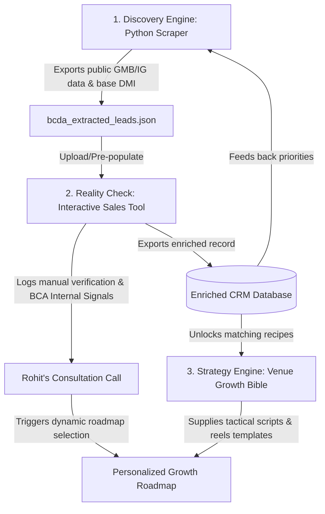

# Triangular Intelligence Integration — Making the Scraper, Sales Tool, & Bible Smarter

This document outlines the operational and technical integration of DigiVenue's core assets:
1. **The Discovery Engine** (`mumbai_banquet_scraping_engine.py`)
2. **The Reality Check Pitch Tool** (`digistories-sales-tool-v2.html`)
3. **The Strategy Engine** (`venue-growth-bible-engine.html`)

Instead of acting as isolated tools, these assets are connected in a **Triangular Intelligence Loop** that automates discovery, personalizes sales consultation, and structures operational tracking.

---

## 1. The Triangular Intelligence Loop Architecture



### The Three Interfaces
* **The Scraper (API/Automated):** Establishes the digital baseline of the market.
* **The Sales Tool (Browser/Interactive):** Serves as the face-to-face consultation dashboard during sales calls.
* **The Growth Bible (Knowledge/Asset):** Serves as the structural delivery payload (the "gift" or roadmap) for the lead.

---

## 2. Technical Integration Flows

To connect these tools, we utilize a unified data format. The data schema generated by the Python scraper must match the fields in the Sales Tool, and the audit failures in the Sales Tool must directly map to strategic section IDs inside the Growth Bible.

### Flow A: Python Scraper $\longrightarrow$ Sales Tool (Pre-population)
Instead of forcing the sales representative to manually look up reviews, ratings, websites, and Instagram handles during a call, the Sales Tool pulls directly from the scraper's output.

1. **The JSON Bridge:** The scraper writes its output to `bcda_extracted_leads.json`.
2. **Dynamic Loading:** We integrate a simple "Upload JSON" button or local storage cache in `digistories-sales-tool-v2.html`.
3. **Search & Select:** The representative types the venue name in a search dropdown. The Sales Tool instantly auto-populates:
   * Google rating and review count.
   * Website URL presence.
   * Instagram handle and estimated post frequency.
   * The calculated baseline DMI score.

### Flow B: Sales Tool $\longrightarrow$ Unified CRM Database (BCA Enrichment)
During the consultation call, the representative validates the public details and logs the **BCA network internal signals**:
* Presence of a second-generation operator.
* Multiple venue operations.
* Specific calendar bottlenecks or paper diary usage.
* Dissatisfaction with booking portals.

Upon finishing the call, the representative clicks **"Export Enriched Record"** in the Sales Tool. This downloads an updated JSON/CSV line which is merged back into the master dataset. 

* **Why this makes the Scraper smarter:** The next time the Python engine runs or queries the database, it can run priority queries (SQL/Python filtering) like:
  ```text
  Find all venues with DMI < 50 that have 2nd Gen operators involved and are currently using paper diaries.
  ```

### Flow C: Sales Tool & Central DB $\longrightarrow$ Venue Growth Bible (Dynamic Roadmaps)
Instead of handing over a massive 3,000-line strategy document to a busy banquet hall owner, we extract only the tactical recipes they need.

Each failure checkmark in the Sales Tool's audit section corresponds to a specific **Section Tag** in the Venue Growth Bible:

| Audit Checkpoint (Failed) | Index Gap | Bible Target Section | Actionable Asset Delivered |
| :--- | :--- | :--- | :--- |
| **No Active Reels** | Instagram Momentum | `#instagram-reels-recipes` | 5 pre-written reels scripts for luxury decor walkthroughs. |
| **Low Google Review Volume** | Google Trust | `#review-generation-loop` | The WhatsApp follow-up script for wedding families. |
| **No Floating WhatsApp CTA** | Web Conversion | `#website-friction-reductions` | Code snippet for a floating WhatsApp chat bubble. |
| **Paper Booking Diary** | Operational System | `#smartos-transition-play` | Blueprint for moving booking records to a digital dashboard. |
| **Decorator Disputes** | Network & Royalty | `#vendor-contract-templates` | Template for decorator commission agreements. |

---

## 3. Operational SOP for Sales Consultations

To run this loop cleanly, the sales representative follows this simple three-step daily routine:

```
[Morning: Load & Prep]
Python Scraper runs -> Generates latest suburb files -> Rep loads JSON into Sales Tool.

[Midday: The Consultation]
Pitches audit via Sales Tool -> Enriches with BCA Internal Signals -> Shows DMI reality check.

[Evening: The Delivery]
Clicks "Generate Roadmap" -> Extracts custom Bible strategies -> WhatsApps 2-page PDF.
```

### Pre-Call Preparation
* The sales representative selects a target suburb (e.g., *Chembur*).
* They review the prioritized lead list generated by the Python query, looking at the venues sorted by low DMI scores and high active search volume.
* They open `digistories-sales-tool-v2.html` on their tablet or laptop.

### During the Call
* The representative walks the owner through their live audit: *"Your hall has beautiful interiors, but on Google, you have old photos and your last review was three months ago. A family scrolling at night assumes you are quiet."*
* The representative checks/unchecks the audit signals based on the live verification.
* They log the owner's operational details: *"Do you currently write your bookings in a paper register?"* (Checks "Paper Diary").

### Post-Call Follow-up
* The Sales Tool calculates the final verified DMI score and identifies the key conversion gaps.
* The representative clicks **"Generate Roadmap"**. The tool dynamically pulls the corresponding strategic guides from `venue-growth-bible-engine.html` and packages them into a clean, 2-page print-friendly **"Banquet Digital Modernization Roadmap"**.
* This roadmap is sent to the owner over WhatsApp within 10 minutes of the call, positioning DigiVenue as a helpful operational partner rather than a pushy agency.

---

## 4. Technical Blueprint for JavaScript Integration

To build this connection inside the browser-based Sales Tool (`digistories-sales-tool-v2.html`), we can implement a simple JSON parser and a recipe extractor.

### Step A: Auto-Load Scraper Data (JS Prototype)
Add a JSON input handler to load the output from `bcda_extracted_leads.json`:

```javascript
// Function to load scraped data into the Sales Tool
function loadScraperData(jsonData) {
    const leads = JSON.parse(jsonData);
    const selectEl = document.getElementById("venue_selector");
    
    leads.forEach(lead => {
        let opt = document.createElement("option");
        opt.value = lead.name;
        opt.textContent = `${lead.name} (${lead.address.split(',')[1] || lead.address})`;
        opt.dataset.details = JSON.stringify(lead);
        selectEl.appendChild(opt);
    });
}

// When a venue is selected, populate the fields automatically
document.getElementById("venue_selector").addEventListener("change", function(e) {
    const selectedOpt = e.target.options[e.target.selectedIndex];
    if (!selectedOpt.dataset.details) return;
    
    const lead = JSON.parse(selectedOpt.dataset.details);
    document.getElementById("v_name").value = lead.name;
    document.getElementById("v_loc").value = lead.address;
    document.getElementById("v_instagram").value = lead.instagram;
    document.getElementById("v_website").value = lead.website;
    
    // Auto-check audit boxes based on scraped values
    setAuditState("ig_reels", lead.instagram !== "None" && lead.target_tier !== "Tier C (Traditional - Needs Education)");
    setAuditState("gmb_reviews", lead.reviews_count >= 50);
    setAuditState("web_mobile", lead.website !== "None");
});
```

### Step B: Dynamic Strategy Packaging
To extract matching recipes from `venue-growth-bible-engine.html` based on audit failures:

```javascript
function generateRoadmap(auditResults) {
    let activeRecipes = [];
    
    // Map failed checks to Bible anchor links or embedded texts
    if (!auditResults.ig_reels) {
        activeRecipes.push({
            title: "Instagram Walkthrough Strategy",
            link: "venue-growth-bible-engine.html#instagram-reels-recipes",
            tip: "Shoot empty setups right before the event starts to capture the lighting design without crowds."
        });
    }
    if (!auditResults.gmb_reviews) {
        activeRecipes.push({
            title: "Post-Wedding Review Loop",
            link: "venue-growth-bible-engine.html#review-generation-loop",
            tip: "Send a personalized WhatsApp to the father of the bride 2 days after the wedding expressing gratitude and asking for feedback."
        });
    }
    if (auditResults.paper_diary) {
        activeRecipes.push({
            title: "SmartOS Transition Blueprint",
            link: "venue-growth-bible-engine.html#smartos-transition-play",
            tip: "Migrate your bookings list to a digital view to automatically track customer deposits and decorator royalties."
        });
    }
    
    displayRoadmapToUser(activeRecipes);
}
```

By linking the scraper, tool, and bible in this manner, every lead we crawl becomes an automated sales preparation sheet, and every sales call we execute delivers a highly tailored strategy roadmap that drives the owner directly toward adopting **DigiStories** and **SmartOS**.
