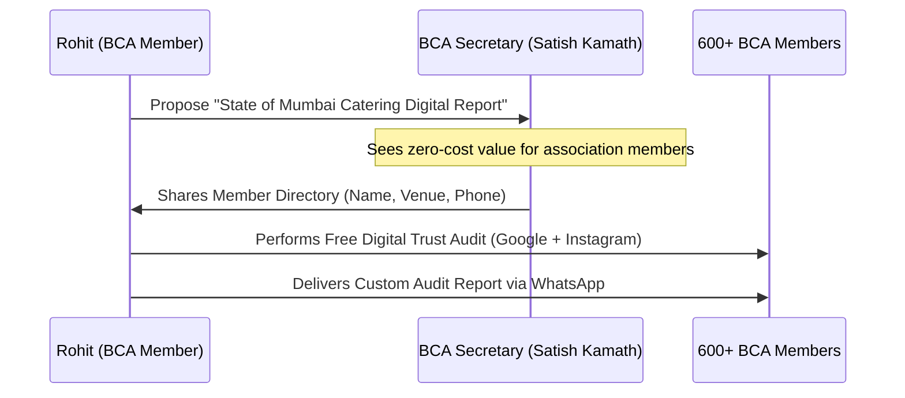

# BCA Strategic Partnership Playbook — DigiVenue & DigiStories

Knowing the Bombay Caterers Association (BCA) committee personally is a massive competitive advantage. It allows you to skip cold sales pitches and position DigiVenue as a **collaborative industry initiative** rather than a third-party vendor.

This playbook outlines a dual-track strategy to:
1. **Top-Down:** Associate with BCA as their official **"Digital & Technology Partner."**
2. **Bottom-Up:** Systematically access, audit, and convert the **600+ BCA members** using **DigiStories** and **SmartOS**.
3. **Membership Growth:** Leverage DigiVenue's audits as a recruitment engine to onboard unregistered Mumbai caterers and venues into the BCA.

---

## Track 1: The Top-Down Pitch — Becoming BCA's Official "Digital Partner"

The BCA committee (Yogesh Chandrana, Sunil Vengurlekar, Satish Kamath) is constantly looking for ways to add value to their members and protect them from aggregator portals (like WedMeGood, Weddingz, etc.) that charge heavy commissions. 

```
[BCA's Core Problem] 
Aggregators dominate local SEO -> Members pay 15-20% commissions -> Profits shrink.

[DigiVenue's Solution]
Empower members to build direct digital trust -> Disintermediate portals -> Keep profits local.
```

### The Value Proposition to the Committee
Pitch this as the **"BCA Member Digital Modernization Initiative."**
* **The Pitch:** "Portals are eating our industry's margins. When a family Googles a member, they often find a portal link instead of the member's direct profile. DigiVenue is built by a BCA member to help fellow members reclaim their digital ownership and get bookings directly, with zero commissions."
* **The Alignment with ICTEM:** BCA runs the *Institute of Catering Technology & Event Management (ICTEM)*. Position DigiVenue's software training as an extension of their educational mission.

### What the Partnership Looks Like:
1. **Co-Branded "BCA Digital Trust Audits":** 
   * DigiVenue becomes the official audit engine for the association.
   * "BCA members get a free quarterly Online Trust Analysis ($100 value) to see if they are losing bookings to portals."
2. **BCA Expo Integration:**
   * Secure a premium, official slot at the annual *Catering & Decor Expo*.
   * Run live website and Instagram audits for members at a dedicated "DigiVenue Digital Clinic" booth.
3. **Official Seal of Endorsement:**
   * Place the "Official Technology Partner of Bombay Caterers Association" badge on the DigiVenue website to build massive local trust.

---

## Track 2: The Data Acquisition Strategy

To connect with the 600+ members, you need their contact details (Name, Business Name, WhatsApp, Location, Venue Type). You can acquire this list officially through the committee using a **"Give-to-Get"** model:



### The "State of the Industry Report" Play:
1. **Approach the Hon. Gen. Secretary (Satish Kamath):** 
   * "I want to compile the first *'State of Mumbai Catering Digital Presence Report'* at my own cost. I will audit all 600 members' Google Listings and Instagram pages to show the association where we are strong and where we are losing business to portals."
2. **The Request:**
   * "To do this, I need the member database (names, phone numbers, and business names) so we can run the audits. The final report will be co-published with BCA and shared at the next General Body meeting."
3. **The Result:**
   * You get the entire 600+ verified contact database officially, with the association’s blessing.

---

## Track 3: The Bottom-Up Conversion Funnel

Once you have the data, you execute a highly personalized, member-to-member WhatsApp campaign. Do **not** send mass automated spam. Group the 600 members into batches of 30 and run a warm outreach sequence.

### Phase 1: The Peer-to-Peer Warm Introduction (WhatsApp Script)
Since you are a BCA member, your response rate will be close to 80%.

> **WhatsApp Script 1: The Introduction**
> *"Namaste [First Name] Bhai, Rohit Nate here from Dadar (fellow BCA member).*
> 
> *I hope the wedding season prep is going well. I’m currently helping the BCA committee audit the online presence of our members so we can stop depending entirely on commission portals.*
> 
> *I’ve prepared a quick 2-minute digital check for [Business Name/Catering Name]. Can I send you the link to see how your catering looks to families searching online at night? (It's free for BCA members)."*

---

### Phase 2: The Audit Delivery (DigiStories Hook)
Use the [digistories-sales-tool-v2.html](file:///C:/Users/rohit/Downloads/DigiStories/digistories-sales-tool-v2.html) engine to calculate their score (Invisible / Present but Weak / Active). 

* Send them their scorecard.
* Point out the **"Reality Check"**: 
  * "Bhai, your food and setups are outstanding, but your Instagram hasn't been updated since last Diwali, and your Google Listing only has guest photos. A family looking at this at 11 PM will assume you are closed or inactive."
* **Call to Action:** "Let us handle your event-day reels and Google reviews for ₹15,000/month. One booked event pays for the entire year."

---

### Phase 3: The SmartOS Caterer-Native Pitch
Caterers have different operational problems than banquet hall owners. To sell **SmartOS** to the 600 caterers, highlight these three catering-specific pain points:

| Caterer Pain Point | SmartOS Solution | The Pitch |
| :--- | :--- | :--- |
| **Offline Diary Clashes:** Booking two premium catering setups on the same day without realizing staff limits. | **Multi-Event Calendar:** Interactive calendar that flags resource limits (waitstaff, chefs) on popular wedding dates. | *"Never double-book your main chefs. SmartOS warns you the moment you try to log a third wedding on a heavy Muhurat day."* |
| **Messy Menu Customization:** WhatsApping menu changes back and forth, leading to wrong items served on event day. | **Dynamic Menu Builder:** Generates a clean, print-friendly PDF menu linked to the booking invoice. | *"Create, customize, and locking in the menu directly inside the invoice so your kitchen staff cooks exactly what was promised."* |
| **Valet / Decorator Royalty Disputes:** Tracking how much commission is owed to the venue or decorator. | **Vendor Royalty Calculator:** Automatically splits the catering bill and logs vendor payouts. | *"SmartOS calculates decorator and venue commissions automatically, so you don't spend Tuesdays doing diary math."* |

---

## Track 4: BCA Membership Recruitment Engine (The Growth Carrot)

There are 5,000+ caterers and 1,000+ banquets in Mumbai, but BCA currently represents only 600 (~10% market share). The ultimate pitch to become BCA's official partner is showing the committee how **DigiVenue will help double BCA's membership roster**.

```
[Unregistered Caterers]
Struggling to find bookings -> Low visibility online -> Open to business help.

[The Hook]
DigiVenue runs co-branded audits -> "Join BCA to unlock free digital upgrades & SmartOS."
```

### The Membership Expansion Strategy:

#### 1. Co-Branded "Mumbai Catering Modernization Campaign"
* DigiVenue and BCA launch a joint marketing campaign targeted at the 4,400+ unregistered caterers and 400+ unregistered banquets.
* We run localized social media ads and search scraping to identify weak/inactive caterers.
* **The Outreach:** We send them a co-branded audit: 
  > *"We reviewed your online catering listing as part of the **BCA Mumbai Modernization Drive**. Your business scored 30/100 (Invisible).*
  > 
  > *To unlock your full digital report, setup guidance, and a 3-month free trial of the SmartOS catering calendar, register as a BCA member today."*

#### 2. The "Member-Get-Member" Tech Perk
* Existing BCA members who refer a new member to BCA get a **15% discount on DigiStories** management or **SmartOS** licenses.
* This incentivizes your 600 peers to actively recruitment other caterers, using DigiVenue as the technology incentive.

#### 3. Joint Zonal Workshops (The Dadar, Thane, Vashi Seminars)
* BCA and DigiVenue host monthly local seminars: *"How to Win Direct Wedding Bookings in 2026."*
* **Access Rules:** 
  * Free for BCA members.
  * ₹500 entry fee for non-members (completely waived if they sign up for BCA membership at the registration desk).
* This provides BCA with a constant stream of new membership dues while positioning DigiVenue as the default technology infrastructure.

---

## 5. Execution Timeline & Next Steps

```
[Month 1: Top-Down Approval]
- Pitch the "Modernization Initiative & Member Recruitment Campaign" to Yogesh Chandrana & Satish Kamath.
- Secure the official member database for the audit.

[Month 2: Auditing & Benchmarking]
- Run the 600 members through the Sales Tool.
- Compile the "State of Mumbai Catering Digital Report".
- Map the unregistered caterers list in major suburbs.

[Month 3: Rollout & Outreach]
- Present the report at the BCA meeting.
- Launch the batch-by-batch WhatsApp outreach delivering custom audits.
- Run the first joint regional seminar in Dadar to recruit non-members.
```
