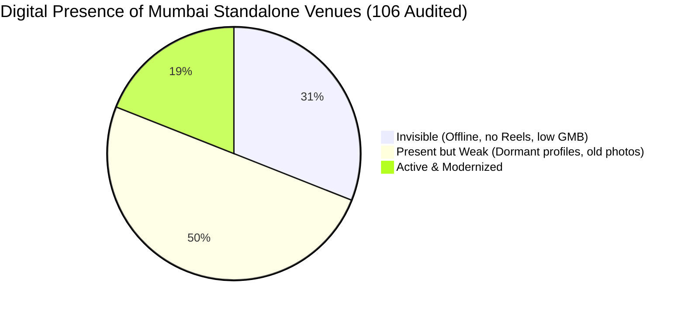

# Bombay Caterers Digital Analysis (BCDA) — 2026 Industry Report
**A Collaborative Modernization Initiative by the Bombay Caterers Association (BCA) & DigiVenue**

---

## Executive Summary: The Silent Revenue Leak

The modern Indian wedding discovery journey has moved entirely online:
$$\text{Instagram Reels} \longrightarrow \text{Google Maps Search} \longrightarrow \text{Google Reviews} \longrightarrow \text{Direct WhatsApp Inquiry} \longrightarrow \text{Booking}$$

While Mumbai's standalone banquet halls, lawns, and caterers excel in physical hospitality (interiors, setups, taste), they are digitally silent. When a family scrolls a venue's page at 11 PM and finds a dormant profile, they assume the business is inactive and quietly move on. **Operators only see their actual bookings—they never see the enquiries they lose silently online.**

This report outlines **Part 1 (The Internet Baseline)** of our digital audit of standalone venues in Mumbai, Thane, Navi Mumbai, and Pune, followed by **Part 2 (The BCA Member Network Plan)** to help the 600+ BCA members modernise their operations.

---

## PART 1: The Internet Baseline (Public Web Audit)

We conducted a public internet audit of **106 independent, standalone banquet halls, wedding lawns, and caterers** across Mumbai Suburbs, Central Mumbai, Thane, Navi Mumbai, and Pune to establish a baseline of the industry's digital health.

### Key Audit Metrics & Findings:



* **Total Venues Audited:** 106
* **Average Google Reviews per Venue:** 92 reviews (indicates high physical activity but low client review-collection habits).
* **The Gaps Discovered:**
  1. **31% of Venues are "Invisible" (33/106):** They do not show up consistently on Google Maps, have less than 15 total reviews, and have zero active Instagram presence. Younger couples cannot find them.
  2. **50% of Venues are "Present but Weak" (53/106):** They have a Google Business listing or Instagram account, but it is dormant (no posts in 90+ days, no video/reels content, and low-res photos taken on staff phones).
  3. **Only 19% of Venues are "Active" (20/106):** They post reels weekly, respond to reviews, and have a clear WhatsApp booking CTA. These 19% are capturing the majority of online wedding inquiries in Mumbai.

> [!IMPORTANT]
> **81% of standalone, mid-market wedding venues and caterers in Mumbai are losing direct bookings** because they lack a basic, active online trust presence. They are forced to rely on expensive third-party commission portals.

---

## PART 2: The BCA Internal Network Audit Plan (600+ Members)

Knowing that BCA represents approximately 600 caterers, decorators, and banquets, we will scale this public analysis into a deeper, value-added **Internal Member Audit** to help members secure direct inquiries.

```
[Member Registry Input]
BCA shares member listing (Business Name, Phone, Location)
       │
       ▼
[DigiVenue Audit Execution]
We run GMB, Instagram, and website reviews (Calculate Score 0-100)
       │
       ▼
[Tailored Delivery via WhatsApp]
Rohit Nate (fellow member) sends custom PDF audit scorecard + WhatsApp Script
       │
       ▼
[Conversion Meeting]
Demo SmartOS (operations) & DigiStories (social visibility) to modernize the venue
```

### The Member Audit Workflow:

#### 1. Step 1: Member Data Sync
Leveraging your membership and connection with the Hon. Gen. Secretary, Satish Kamath, sync the BCA registry to our [leads_audit_tracker.json](file:///c:/Users/rohit/Downloads/DigiStories/leads_audit_tracker.json) database.

#### 2. Step 2: The 2-Part Audit (Marketing & Operations)
Each of the 600 members will receive a co-branded **BCA Digital Health Certificate** covering:
* **The Marketing Audit (DigiStories):** Is the Instagram profile posting weekly reels? Are GMB reviews fresh (less than 14 days old)? Are Google photos professional (empty vs. full setups)?
* **The Operational Audit (SmartOS):** Does the member use paper registers or Excel diaries? Are they vulnerable to double-booking errors? How are they calculating vendor payouts and managing menu customization invoices?

#### 3. Step 3: Zonal PDF Distribution
 we package these audits into custom scorecards and distribute them zone-by-zone (Dadar, Borivali, Thane, Vashi, Pune) through local BCA WhatsApp groups, ensuring peer-to-peer delivery from a trusted member.

---

## PART 3: The BCA Recruitment Strategy (Helping BCA Grow)

To secure the committee's full endorsement, the BCDA report will be presented to Yogesh Chandrana and Sunil Vengurlekar as a **BCA Membership Recruitment Tool**. 

With over 5,000+ caterers and 1,000+ venues in Mumbai, BCA has room to grow its 600-member base. We will use the BCDA report as a carrot:

### 1. Co-Branded "Modernization Drive" Ads
* We run targeted social ads for the 4,400+ unregistered caterers: *"Is your catering business invisible online? Get your free BCA Digital Audit & 3-month SmartOS operational trial by registering with the Bombay Caterers Association today."*
* Non-members see a massive, immediate ROI for joining BCA (valuable digital report + software trial).

### 2. The "Digital Helpdesk" Seminars
* Host joint BCA-DigiVenue seminars across Mumbai zones. 
* Attendance is free for BCA members, but non-members must pay ₹500 (waived if they sign up for BCA membership at the door).
* DigiVenue runs live audits for non-members on stage, showing them exactly how they compare to active competitors in their area.

---

## PART 4: Recommended Modernization Package

For the audited members needing assistance, we provide the official BCA Modernization Suite at special member pricing:

1. **DigiStories (Visual Trust Management) — ₹15,000/mo:**
   * In-person event-day reel shoot (4 reels/mo).
   * Weekly GMB updates & professional empty/full setup photography.
   * Automated customer review collection system.
2. **SmartOS (Catering-Native ERP) — Special Member Trial:**
   * 3-Month Free Trial for BCA members.
   * Multi-event calendar to prevent chef/waitstaff double-bookings.
   * Dynamic menu builder linked to automated GST invoices.
   * Vendor royalty calculation system.
