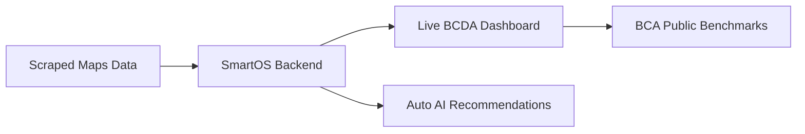

# Mumbai Banquet Mapping & Modernization — Operational Execution Manual
**A Lean Implementation Guide for Virtual Assistants, Team Lead Generators, and Founders**

This manual defines the practical steps to execute the **Bombay Caterers Digital Analysis (BCDA)** campaign without overbuilding technology. It moves from manual spreadsheet logging (Phase 1) to semi-automation (Phase 2) and full software integration (Phase 3).

---

## 1. Phase 1: Manual + AI-Assisted Operations (The Start-Line)

**Objective:** Map your first 200 venues/caterers using a Virtual Assistant (VA) and simple sheets. Do not spend time coding API integrations until you have validated your sales pitch.

### Google Sheets / Airtable Database Schema (Column Structure)
Create a Google Sheet with the following exact columns. This will match the format generated by our [mumbai_banquet_scraping_engine.py](file:///c:/Users/rohit/Downloads/DigiStories/mumbai_banquet_scraping_engine.py) later.

| Column Letter | Header Title | Description / Validation | Data Type |
| :--- | :--- | :--- | :--- |
| **A** | **Venue/Caterer Name** | Official trade name. | Text |
| **B** | **Area / Suburb** | E.g., Dadar, Chembur, Vashi, Thane West. | Text |
| **C** | **Owner / POC Name** | Name of the founder/manager (find via website/LinkedIn). | Text |
| **D** | **WhatsApp Number** | Active mobile number (format: +91 XXXXX XXXXX). | Number |
| **E** | **Google Maps Link** | Direct URL to their Google Business Profile. | URL |
| **F** | **GMB Review Count** | Total number of Google reviews. | Number |
| **G** | **GMB Rating** | Average rating (e.g., 4.2). | Decimal |
| **H** | **Instagram Link** | URL to their Instagram page. | URL |
| **I** | **IG Post Frequency** | "Weekly", "Dormant (>30 days)", or "None". | Dropdown |
| **J** | **Website Link** | Website URL (or mark "None"). | URL |
| **K** | **Booking Diary Style** | "Paper Book", "Excel Sheet", or "SmartOS (Target)". | Dropdown |
| **L** | **DMI Score** | Computed using the ChatGPT prompt below. | Number (0-100) |
| **M** | **Target Tier** | Tier A (Active), Tier B (Weak), Tier C (Invisible). | Dropdown |

---

### Virtual Assistant (VA) Standard Operating Procedure (SOP)

```
[Step 1: Map Google Maps]
Search maps for: "banquet hall in [Suburb]" (E.g., Borivali).
Log name, rating, address, website, and total reviews.

[Step 2: Scan Website & Socials]
Click website link. Extract email, phone number, and look for Instagram/Facebook links.

[Step 3: Audit Instagram Profile]
Open their Instagram handle. Check if they have posted a Reel in the last 7 days.
Check if their bio contains a direct WhatsApp CTA.

[Step 4: Generate DMI Score via ChatGPT]
Copy these details, paste them into the ChatGPT DMI Prompt, and log the output.
```

---

### The ChatGPT DMI Scoring & Pitch Prompt
Give your VA this prompt to copy-paste into ChatGPT when auditing a lead. It matches our [maturity_index_calculator.py](file:///C:/Users/rohit/.gemini/antigravity/brain/f18e9b59-555e-4625-bc0c-9d3993a2260b/scratch/maturity_index_calculator.py) script logic.

```
You are the DigiVenue Digital Analyst. Calculate the Digital Maturity Index (DMI) for this venue out of 100 based on these metrics:

1. Instagram Activity (Max 20): 18 if posting weekly, 10 if dormant, 0 if no account.
2. Reel Consistency (Max 10): 8 if regular video walkthroughs, 3 if static images only, 0 if none.
3. Google Reviews (Max 20): 16 if reviews > 50, 12 if reviews 10-50, 5 if <10. Add +4 bonus if rating >= 4.4.
4. Inquiry Conversion CTA (Max 15): 12 if has direct booking link/WhatsApp CTA, 0 if none.
5. Website Quality (Max 10): 8 if mobile-optimized with forms, 4 if slow/outdated layout, 0 if no site.
6. WhatsApp Integration (Max 10): 8 if wa.me link exists, 0 if none.
7. Brand Consistency (Max 5): 4 if design matches across site/IG, 1 if messy.
8. Response Structure (Max 10): 8 if auto-reply exists, 2 if completely manual.

Inputs to score:
- Venue Name: [Input Venue Name]
- Area: [Input Area]
- GMB Reviews: [Input count] (Rating: [Input rating])
- Instagram handle: [Input handle/None]
- Website link: [Input link/None]
- WhatsApp link: [Input link/None]

Output format:
1. Score Breakdown (list scores for the 8 categories).
2. Total Score (/100) and Tier (Tier A: >=65, Tier B: 35-64, Tier C: <35).
3. Personalized WhatsApp Outreach Script using Rohit Nate (Dadar BCA member) peer-to-peer tone.
```

---

## 2. Phase 2: Semi-Automation (The Scaling Stage)

**Objective:** Once you have converted your first 5–10 clients manually and validated the DMI pitch, transition your database tracking to our semi-automated Python engine to map the rest of the 1,000+ banquets and 5,000+ caterers.

```
[Setup Place Details API] --> [Run Scraper Script] --> [Generate Lead CSV/JSON] --> [Import into CRM]
```

### Action Items for Phase 2:
1. **Transition to our Scraper:** 
   Run [mumbai_banquet_scraping_engine.py](file:///c:/Users/rohit/Downloads/DigiStories/mumbai_banquet_scraping_engine.py) to automate Google Maps Place details extraction and website parsing.
2. **Setup basic CRM (e.g., Airtable / HubSpot):** 
   Import the generated CSV database [bcda_extracted_leads.csv](file:///c:/Users/rohit/Downloads/DigiStories/bcda_extracted_leads.csv) into Airtable. Setup automation to color-code leads based on DMI score (Red for Tier C, Yellow for Tier B, Green for Tier A).
3. **Outreach Tracking:** 
   Track progress inside your TODO checklist [task.md](file:///C:/Users/rohit/.gemini/antigravity/brain/f18e9b59-555e-4625-bc0c-9d3993a2260b/task.md) to log which WhatsApp audits have been sent and which are pending demos.

---

## 3. Phase 3: Full Intelligence Platform (The Ultimate Moat)

**Objective:** Integrate your data directly into **SmartOS** and launch a live benchmarking dashboard.



### Future Platform Architecture:
1. **Live Territory Dashboards:**
   * A public map on your site showing: *"The Online Trust Map of Mumbai's Wedding Industry."*
   * Venues are pinned and color-coded. Non-members visit the map, see their venue pinned in Red (Invisible), and click: *"Claim my venue profile & request modernization support."*
2. **AI-Driven SmartOS Recommendation Engine:**
   * When a venue logs into SmartOS, the system scans their Google reviews and automatically alerts them:
     * *"You had 4 negative reviews this week about 'valet parking wait times.' Send this automated feedback apology script via WhatsApp."*
     * *"You haven't posted an Instagram Reel in 7 days. Here are 3 signature food timetables you should shoot today."*
3. **Ecosystem-Wide Lead Attribution:**
   * Sync inquiries between caterers and banquets. If a caterer logs an event in SmartOS at an un-mapped venue, the system automatically runs an audit on that venue and flags it as a warm sales target.
