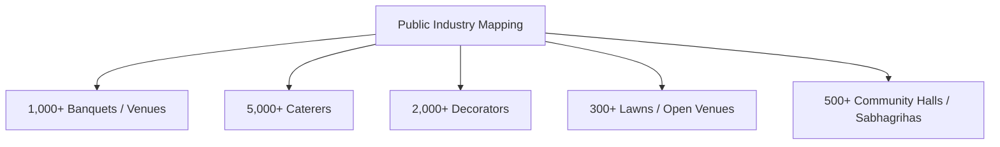
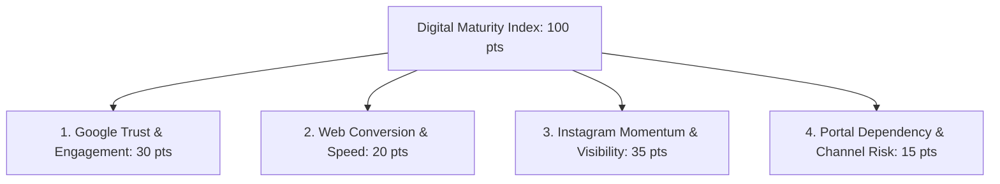

# Mumbai Catering & Banquet Digital Readiness Initiative — Master Blueprint
**A Strategic Operational Roadmap to Reclaim Digital Ownership for Mumbai’s Caterers and Venues**

---

## 1. The 5-Layer Operational Architecture

To successfully onboard the catering and banquet ecosystem, we deploy a five-tier architecture that moves from anonymous web intelligence to co-branded institutional endorsement, culminating in direct commercial conversion.

| Layer | Focus Area | Core Operational Mechanism |
| :--- | :--- | :--- |
| **Layer 1** | **Public Internet Intelligence** | Large-scale mapping of all 1,000+ banquets and 5,000+ caterers across Mumbai suburbs using automated web and social audits. |
| **Layer 2** | **BCA Member Intelligence** | Official integration with the BCA registry, layering operational data (diary styles, waitstaff limits) over their public web profiles. |
| **Layer 3** | **Industry Benchmarking** | Computing the **Digital Maturity Index (DMI)** to show members exactly where they stand compared to local competitors. |
| **Layer 4** | **Controlled Member Outreach** | Soft, peer-to-peer WhatsApp delivery of personalized audit snapshots from a fellow member, keeping it educational rather than sales-y. |
| **Layer 5** | **Commercial Conversion** | Natural introduction of **DigiStories** to resolve the marketing gaps and **SmartOS** to eliminate the operational chaos. |

---

## PHASE 1 — Public Digital Industry Mapping

### 1. Objective: Building the Mumbai Industry Database
We do not limit our initial mapping to the 600 registered BCA members. **If you only analyze members, the report feels like an internal newsletter.** 

To create authority, you must benchmark the entire Mumbai market (1,000+ banquets, 5,000+ caterers). This establishes the scale of the "online invisibility" problem and positions BCA as the leading authority defending the industry.



### 2. Public Data Sources & Audit Vectors:
We scrape and audit four digital contact surfaces:
* **Google Maps (The Core Trust Signal):** Review counts, average ratings, age of the last owner response, presence of professional empty vs. full setup photos, and category accuracy.
* **Instagram (The Discovery Signal):** Reels consistency (weekly vs. dormant), aesthetic video quality, highlights organization, followers vs. engagement ratio, and presence of a direct WhatsApp booking link.
* **Wedding Portals (The Disintermediation Map):** Listing presence on WedMeGood or WeddingWire. We track if their pricing is transparent, if their images look outdated, and if leads are being routed through portal-controlled phone numbers.
* **Websites (The Conversion Terminal):** Mobile optimization, page speed, presence of a working booking form, and direct WhatsApp API integration.

### 3. The Deep-Dive Digital Maturity Index (DMI) — 100-Point Scoring Model

We calculate each operator's DMI score using a multi-dimensional rubric that measures both customer-facing trust and operational leak points.



#### Dimension 1: Google Trust & Engagement (GTE) — Max 30 Points
* **Review Volume & Rating (10 pts):** Baseline market popularity score.
* **Review Freshness (5 pts):** Latest review posted < 7 days ago = 5 pts; < 30 days = 3 pts; > 90 days = 0 pts (signals to families if the venue is currently active).
* **Owner Response Rate (5 pts):** Replies to >80% of reviews = 5 pts; replies to some = 2 pts; no replies = 0 pts (shows customer care).
* **Photo Quality & Setup Diversity (5 pts):** >100 professional photos of empty vs. full decorated setups = 5 pts; only low-res guest uploads = 1 pt.
* **Category Optimization (5 pts):** Correct primary and secondary categories (e.g., "AC Banquet Hall", "Wedding Lawn").

#### Dimension 2: Web Conversion & Speed (WCS) — Max 20 Points
* **Mobile Speed & Load Optimization (5 pts):** Loads in <3 seconds on mobile data without layout shifts.
* **Frictionless Booking Form (5 pts):** Simple fields with auto-fill support (no multi-page forms).
* **Floating WhatsApp CTA (5 pts):** Persistent bubble with a pre-filled template.
* **Transparency & Visual Freshness (5 pts):** Starts-from pricing shown, with real wedding gallery shoots instead of stock photos.

#### Dimension 3: Instagram Momentum & Visibility (IVM) — Max 35 Points
* **Video/Reel Freshness & Frequency (10 pts):** Reel posted < 7 days ago = 10 pts; weekly consistency = 5 pts; dormant > 30 days = 0 pts.
* **Video Authenticity (10 pts):** Real wedding walkthroughs and decor setups = 10 pts; stock templates or text flyers = 2 pts.
* **Audience Engagement & Reach (5 pts):** Ratio of view counts to followers (shows organic health).
* **Profile Optimization (10 pts):** Bio CTA booking link, WhatsApp integration, and organized Highlights (e.g., "Halls", "Decor", "Menu", "Reviews").

#### Dimension 4: Portal Dependency & Channel Risk (PDC) — Max 15 Points
* **Portal Dependency (5 pts):** Ranks via WedMeGood/WeddingWire but lacks direct organic ranking = 0 pts; ranks independently = 5 pts.
* **Facebook Activity (5 pts):** Active Facebook page (critical for older operators and family decision-makers) = 5 pts; dead page = 1 pt.
* **Cross-Channel Brand Consistency (5 pts):** Identical logos, phone numbers, and names across GMB, IG, Web, and Portals.

---

## PHASE 2 — BCA Internal Network Strategy

### 1. Positioning: The "BCA Digital Readiness Initiative"
Do **not** approach the secretary (Satish Kamath) asking for member data to sell software. Instead, pitch a co-branded modernization project.

```
[The Wrong Pitch]
"Give us your database so we can demo our booking software and Instagram services."
(Result: Rejection. Feels like data mining.)

[The Right Pitch]
"Let's launch the BCA Digital Readiness Initiative. We will audit the entire membership for free, show them how to stop paying portal commissions, and make BCA India's first digitally benchmarked association."
(Result: Endorsement. Feels member-centric.)
```

### 2. The Pitch to Yogesh Chandrana & Sunil Vengurlekar:
1. **The Younger Operator Problem:** Younger, tech-savvy caterers and decorators are not joining traditional associations. They want practical, modern value. Partnering with DigiVenue shows that BCA supports digital visibility.
2. **Reclaiming Digital Ownership:** Commission portals are taking 15% on leads. By teaching members how to capture direct Google reviews and post reels, BCA helps members keep their margins local.
3. **The Deliverable:** Every member gets a free co-branded **BCA Digital Health Certificate** and a 3-month trial of **SmartOS** to eliminate double-booking risks.

---

## PHASE 3 — The Industry Report Structure

We package the public web audit statistics into a co-branded publication: **"The State of Mumbai Catering & Banquet Industry 2026."**

```
SECTION 1: Mumbai Industry Overview
  - Total visible operators (Banquets vs. Caterers).
  - % of venues operating entirely offline (relying on physical register diaries).
  - The direct-to-consumer booking shift.

SECTION 2: Instagram Intelligence
  - % of profiles that are dormant (no posts in 90 days).
  - % of banquets using static stock templates vs. real event videos.
  - The Reel engagement gap (why likes don't equal bookings).

SECTION 3: Google Maps & Trust Signals
  - % of businesses with unresolved negative reviews.
  - % lacking high-res, professional empty-hall setups.
  - The average age of responses to reviews (most take >30 days to reply).

SECTION 4: The Inquiry Leakage (The SmartOS Hook)
  - Detail the WhatsApp booking chaos: how manual replies lead to lost messages.
  - The staff dependency problem: losing lead files when a coordinator leaves.
  - Double-booking statistics on peak Muhurat dates.

SECTION 5: The Millennial/Gen-Z Decision Cycle (The DigiStories Hook)
  - How brides compare venues at 11 PM.
  - Why active video content drives the site-visit decision before the first call.
```

---

## PHASE 4 — The BCA Presentation: The Wake-Up Call

The presentation to the BCA committee and general body is **not a sales deck**. It is an educational wake-up call led by an insider (a fellow member).

```
SLIDE 1: The Booking Shift (Instagram → Google → WhatsApp)
  - "Our parents booked catering via family referrals. Today, the bride looks at Instagram reels and Google reviews before visiting. The booking is decided before they meet us."

SLIDE 2: The Reality Check (Audited Findings)
  - Show the audited stats: 81% of standalone venues in Mumbai are digitally silent. 
  - Compare a dead profile with an active competitor's profile: "Both have great food, but the active one looks open for business."

SLIDE 3: The Leak (Catering & Booking Chaos)
  - "How many times have we missed an inquiry because it was lost in a manager's WhatsApp? How many times have we struggled with menu changes on a busy Saturday?"

SLIDE 4: The Initiative Launch
  - Announce the "BCA Digital Readiness program."
  - "Every member can claim their free 2-page Digital Trust Audit and unlock their SmartOS digital diary."
```

---

## PHASE 5 — CLIENT ACQUISITION ENGINE

### 1. Target Group Segmentation:
* **Tier A (Fastest Converters):** Younger, second-generation operators who are already active on Instagram but are operationally stressed by inquiry volume. High fit for **SmartOS + DigiStories**.
* **Tier B (Growth Businesses):** Have a decent online presence but lack consistency and systems. High fit for **DigiStories**.
* **Tier C (Traditional Businesses):** Older family operators running entirely on paper diaries. High fit for **SmartOS** (selling it as a digital diary first, slowly migrating them to digital marketing).

### 2. Personalized Audit Outreach Template (via WhatsApp)

> **BCA Initiative Outreach Script:**
> *"Namaste [First Name] Bhai, Rohit Nate here from Dadar (fellow BCA member).*
> 
> *As part of the **BCA Digital Readiness Initiative**, we ran an online presence audit for [Business Name]. Here is your initial status snapshot:*
> 
> * *Instagram Freshness: **[Active / Weak / None]***
> * *Google Maps Reviews: **[High / Moderate / Weak]***
> * *Inquiry Management: **[Manual / Systemized]***
> * *WhatsApp Integration: **[Unorganized / Structured]***
> * *Booking Diary: **[Offline Register / Digital Calendar]***
> 
> *Overall Digital Maturity Score: **[Score]/100**.*
> 
> *We have prepared a 2-page detailed modernization report for [Business Name] showing where your inquiries are leaking. Can I drop the PDF here on WhatsApp?"*

---

## 6. The Long-Term Advantage: The Data Moat

By executing this strategy, DigiVenue slowly builds the **most detailed database of Mumbai's wedding industry operations**.

```
[DigiVenue Core Database]
  ├── Operational Data (Who uses paper registers, who has kitchen bottlenecks)
  ├── Pricing Intelligence (Real menu plate rates across 1,000+ operators)
  ├── Market Share Data (Who is capturing the most direct bookings)
  └── Vendor Networks (Who refers which decorator or florist)
```

This data is impossible for external SaaS startups or generic marketing agencies to replicate. It turns DigiVenue into a **hospitality-native ecosystem** that owns the relationship with the venue operator from start to finish.
